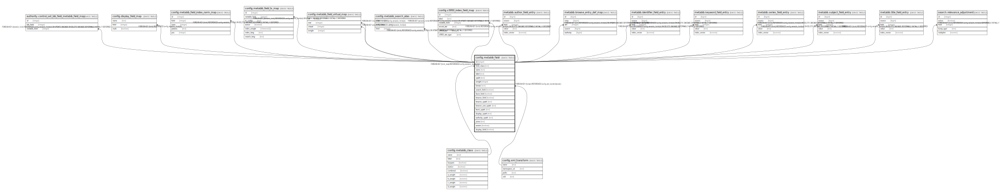

# config.metabib_field

## Description

  
XPath used for record indexing ingest  
  
This table contains the XPath used to chop up MODS into its  
indexable parts.  Each XPath entry is named and assigned to  
a "class" of either title, subject, author, keyword, series  
or identifier.  

## Columns

| Name | Type | Default | Nullable | Children | Parents | Comment |
| ---- | ---- | ------- | -------- | -------- | ------- | ------- |
| id | integer | nextval('config.metabib_field_id_seq'::regclass) | false | [authority.control_set_bib_field_metabib_field_map](authority.control_set_bib_field_metabib_field_map.md) [config.display_field_map](config.display_field_map.md) [config.metabib_field_index_norm_map](config.metabib_field_index_norm_map.md) [config.metabib_field_ts_map](config.metabib_field_ts_map.md) [config.metabib_field_virtual_map](config.metabib_field_virtual_map.md) [config.metabib_search_alias](config.metabib_search_alias.md) [config.z3950_index_field_map](config.z3950_index_field_map.md) [metabib.author_field_entry](metabib.author_field_entry.md) [metabib.browse_entry_def_map](metabib.browse_entry_def_map.md) [metabib.identifier_field_entry](metabib.identifier_field_entry.md) [metabib.keyword_field_entry](metabib.keyword_field_entry.md) [metabib.series_field_entry](metabib.series_field_entry.md) [metabib.subject_field_entry](metabib.subject_field_entry.md) [metabib.title_field_entry](metabib.title_field_entry.md) [search.relevance_adjustment](search.relevance_adjustment.md) |  |  |
| field_class | text |  | false |  | [config.metabib_class](config.metabib_class.md) |  |
| name | text |  | false |  |  |  |
| label | text |  | false |  |  |  |
| xpath | text |  | true |  |  |  |
| weight | integer | 1 | false |  |  |  |
| format | text | 'mods33'::text | false |  | [config.xml_transform](config.xml_transform.md) |  |
| search_field | boolean | true | false |  |  |  |
| facet_field | boolean | false | false |  |  |  |
| browse_field | boolean | true | false |  |  |  |
| browse_xpath | text |  | true |  |  |  |
| browse_sort_xpath | text |  | true |  |  |  |
| facet_xpath | text |  | true |  |  |  |
| display_xpath | text |  | true |  |  |  |
| authority_xpath | text |  | true |  |  |  |
| joiner | text |  | true |  |  |  |
| restrict | boolean | false | false |  |  |  |
| display_field | boolean | false | false |  |  |  |

## Constraints

| Name | Type | Definition |
| ---- | ---- | ---------- |
| metabib_field_field_class_fkey | FOREIGN KEY | FOREIGN KEY (field_class) REFERENCES config.metabib_class(name) |
| metabib_field_pkey | PRIMARY KEY | PRIMARY KEY (id) |
| metabib_field_format_fkey | FOREIGN KEY | FOREIGN KEY (format) REFERENCES config.xml_transform(name) |

## Indexes

| Name | Definition |
| ---- | ---------- |
| metabib_field_pkey | CREATE UNIQUE INDEX metabib_field_pkey ON config.metabib_field USING btree (id) |
| config_metabib_field_class_name_idx | CREATE UNIQUE INDEX config_metabib_field_class_name_idx ON config.metabib_field USING btree (field_class, name) |

## Relations

---

> Generated by [tbls](https://github.com/k1LoW/tbls)
