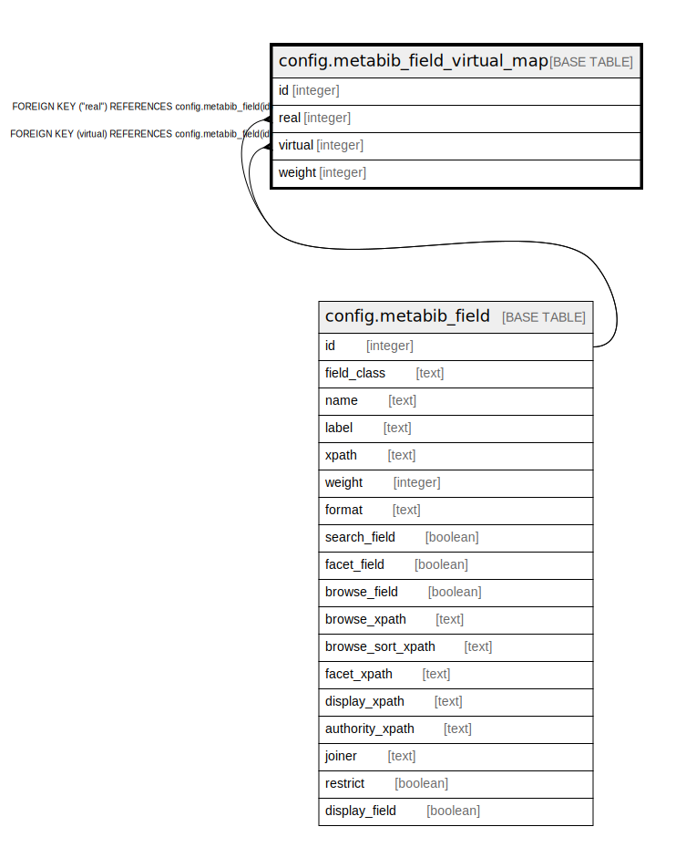

# config.metabib_field_virtual_map

## Description

  
Maps between real (physically extracted) index definitions  
and virtual (target sync, no required extraction of its own)  
index definitions.  
  
The virtual side may not extract any data of its own, but  
will collect data from all of the real fields.  This reduces  
extraction (ingest) overhead by eliminating duplcated extraction,  
and allows for searching across novel combinations of fields, such  
as names used as either subjects or authors.  By preserving this  
mapping rather than defining duplicate extractions, information  
about the originating, "real" index definitions can be used  
in interesting ways, such as highlighting in search results.  

## Columns

| Name | Type | Default | Nullable | Children | Parents | Comment |
| ---- | ---- | ------- | -------- | -------- | ------- | ------- |
| id | integer | nextval('config.metabib_field_virtual_map_id_seq'::regclass) | false |  |  |  |
| real | integer |  | false |  | [config.metabib_field](config.metabib_field.md) |  |
| virtual | integer |  | false |  | [config.metabib_field](config.metabib_field.md) |  |
| weight | integer | 1 | false |  |  |  |

## Constraints

| Name | Type | Definition |
| ---- | ---- | ---------- |
| metabib_field_virtual_map_real_fkey | FOREIGN KEY | FOREIGN KEY ("real") REFERENCES config.metabib_field(id) |
| metabib_field_virtual_map_virtual_fkey | FOREIGN KEY | FOREIGN KEY (virtual) REFERENCES config.metabib_field(id) |
| metabib_field_virtual_map_pkey | PRIMARY KEY | PRIMARY KEY (id) |

## Indexes

| Name | Definition |
| ---- | ---------- |
| metabib_field_virtual_map_pkey | CREATE UNIQUE INDEX metabib_field_virtual_map_pkey ON config.metabib_field_virtual_map USING btree (id) |

## Relations

---

> Generated by [tbls](https://github.com/k1LoW/tbls)
