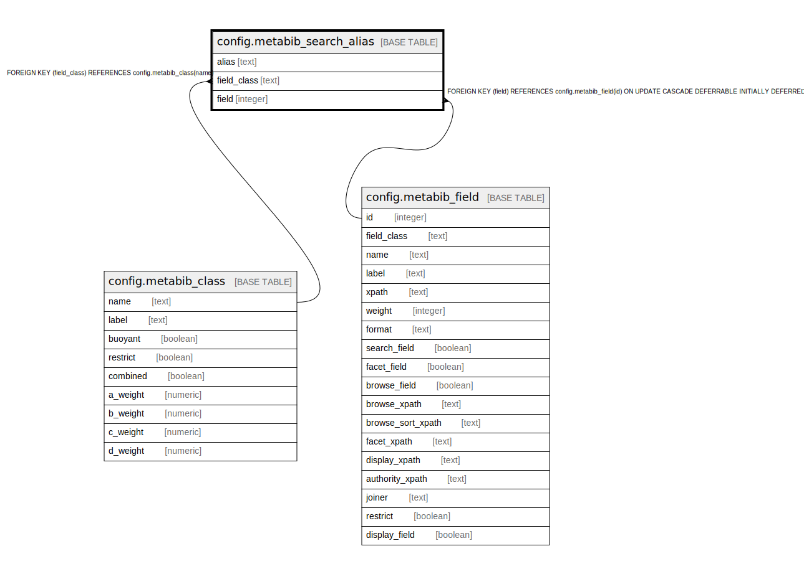

# config.metabib_search_alias

## Description

## Columns

| Name | Type | Default | Nullable | Children | Parents | Comment |
| ---- | ---- | ------- | -------- | -------- | ------- | ------- |
| alias | text |  | false |  |  |  |
| field_class | text |  | false |  | [config.metabib_class](config.metabib_class.md) |  |
| field | integer |  | true |  | [config.metabib_field](config.metabib_field.md) |  |

## Constraints

| Name | Type | Definition |
| ---- | ---- | ---------- |
| metabib_search_alias_field_class_fkey | FOREIGN KEY | FOREIGN KEY (field_class) REFERENCES config.metabib_class(name) |
| metabib_search_alias_field_fkey | FOREIGN KEY | FOREIGN KEY (field) REFERENCES config.metabib_field(id) ON UPDATE CASCADE DEFERRABLE INITIALLY DEFERRED |
| metabib_search_alias_pkey | PRIMARY KEY | PRIMARY KEY (alias) |

## Indexes

| Name | Definition |
| ---- | ---------- |
| metabib_search_alias_pkey | CREATE UNIQUE INDEX metabib_search_alias_pkey ON config.metabib_search_alias USING btree (alias) |

## Relations

---

> Generated by [tbls](https://github.com/k1LoW/tbls)
