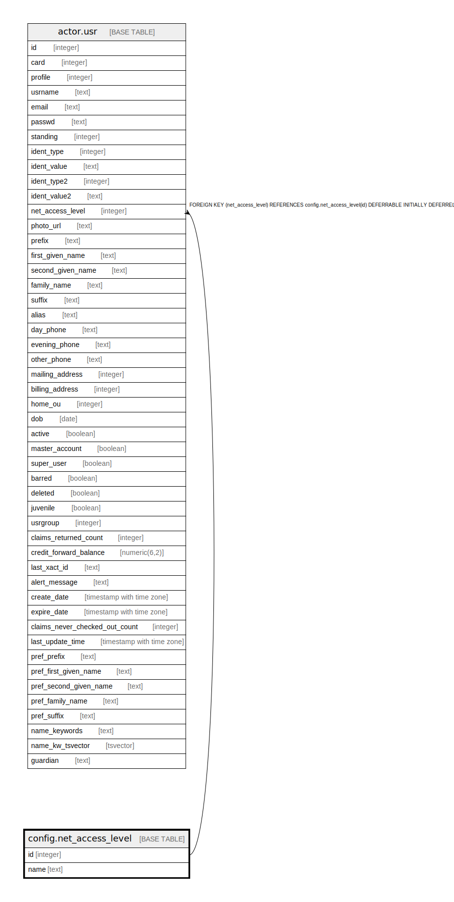

# config.net_access_level

## Description

  
Patron Network Access level  
  
This will be used to inform the in-library firewall of how much  
internet access the using patron should be allowed.  

## Columns

| Name | Type | Default | Nullable | Children | Parents | Comment |
| ---- | ---- | ------- | -------- | -------- | ------- | ------- |
| id | integer | nextval('config.net_access_level_id_seq'::regclass) | false | [actor.usr](actor.usr.md) |  |  |
| name | text |  | false |  |  |  |

## Constraints

| Name | Type | Definition |
| ---- | ---- | ---------- |
| net_access_level_name_key | UNIQUE | UNIQUE (name) |
| net_access_level_pkey | PRIMARY KEY | PRIMARY KEY (id) |

## Indexes

| Name | Definition |
| ---- | ---------- |
| net_access_level_name_key | CREATE UNIQUE INDEX net_access_level_name_key ON config.net_access_level USING btree (name) |
| net_access_level_pkey | CREATE UNIQUE INDEX net_access_level_pkey ON config.net_access_level USING btree (id) |

## Relations

---

> Generated by [tbls](https://github.com/k1LoW/tbls)
