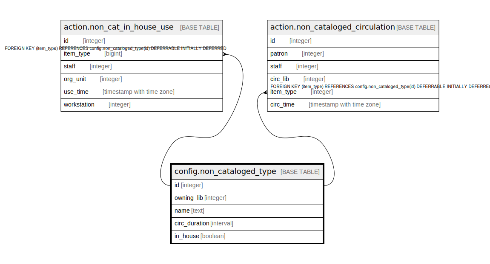

# config.non_cataloged_type

## Description

  
Types of valid non-cataloged items.  

## Columns

| Name | Type | Default | Nullable | Children | Parents | Comment |
| ---- | ---- | ------- | -------- | -------- | ------- | ------- |
| id | integer | nextval('config.non_cataloged_type_id_seq'::regclass) | false | [action.non_cat_in_house_use](action.non_cat_in_house_use.md) [action.non_cataloged_circulation](action.non_cataloged_circulation.md) |  |  |
| owning_lib | integer |  | false |  |  |  |
| name | text |  | false |  |  |  |
| circ_duration | interval | '14 days'::interval | false |  |  |  |
| in_house | boolean | false | false |  |  |  |

## Constraints

| Name | Type | Definition |
| ---- | ---- | ---------- |
| non_cataloged_type_pkey | PRIMARY KEY | PRIMARY KEY (id) |
| noncat_once_per_lib | UNIQUE | UNIQUE (owning_lib, name) |

## Indexes

| Name | Definition |
| ---- | ---------- |
| non_cataloged_type_pkey | CREATE UNIQUE INDEX non_cataloged_type_pkey ON config.non_cataloged_type USING btree (id) |
| noncat_once_per_lib | CREATE UNIQUE INDEX noncat_once_per_lib ON config.non_cataloged_type USING btree (owning_lib, name) |

## Relations

---

> Generated by [tbls](https://github.com/k1LoW/tbls)
