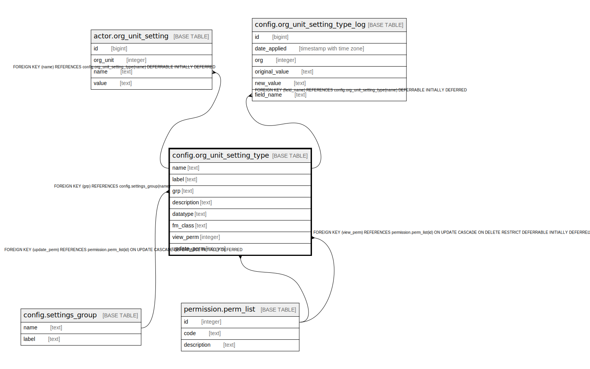

# config.org_unit_setting_type

## Description

## Columns

| Name | Type | Default | Nullable | Children | Parents | Comment |
| ---- | ---- | ------- | -------- | -------- | ------- | ------- |
| name | text |  | false | [actor.org_unit_setting](actor.org_unit_setting.md) [config.org_unit_setting_type_log](config.org_unit_setting_type_log.md) |  |  |
| label | text |  | false |  |  |  |
| grp | text |  | true |  | [config.settings_group](config.settings_group.md) |  |
| description | text |  | true |  |  |  |
| datatype | text | 'string'::text | false |  |  |  |
| fm_class | text |  | true |  |  |  |
| view_perm | integer |  | true |  | [permission.perm_list](permission.perm_list.md) |  |
| update_perm | integer |  | true |  | [permission.perm_list](permission.perm_list.md) |  |

## Constraints

| Name | Type | Definition |
| ---- | ---- | ---------- |
| coust_no_empty_link | CHECK | CHECK ((((datatype = 'link'::text) AND (fm_class IS NOT NULL)) OR ((datatype <> 'link'::text) AND (fm_class IS NULL)))) |
| coust_valid_datatype | CHECK | CHECK ((datatype = ANY (ARRAY['bool'::text, 'integer'::text, 'float'::text, 'currency'::text, 'interval'::text, 'date'::text, 'string'::text, 'object'::text, 'array'::text, 'link'::text]))) |
| org_unit_setting_type_label_key | UNIQUE | UNIQUE (label) |
| org_unit_setting_type_pkey | PRIMARY KEY | PRIMARY KEY (name) |
| org_unit_setting_type_grp_fkey | FOREIGN KEY | FOREIGN KEY (grp) REFERENCES config.settings_group(name) |
| update_perm_fkey | FOREIGN KEY | FOREIGN KEY (update_perm) REFERENCES permission.perm_list(id) ON UPDATE CASCADE DEFERRABLE INITIALLY DEFERRED |
| view_perm_fkey | FOREIGN KEY | FOREIGN KEY (view_perm) REFERENCES permission.perm_list(id) ON UPDATE CASCADE ON DELETE RESTRICT DEFERRABLE INITIALLY DEFERRED |

## Indexes

| Name | Definition |
| ---- | ---------- |
| org_unit_setting_type_label_key | CREATE UNIQUE INDEX org_unit_setting_type_label_key ON config.org_unit_setting_type USING btree (label) |
| org_unit_setting_type_pkey | CREATE UNIQUE INDEX org_unit_setting_type_pkey ON config.org_unit_setting_type USING btree (name) |

## Relations

---

> Generated by [tbls](https://github.com/k1LoW/tbls)
