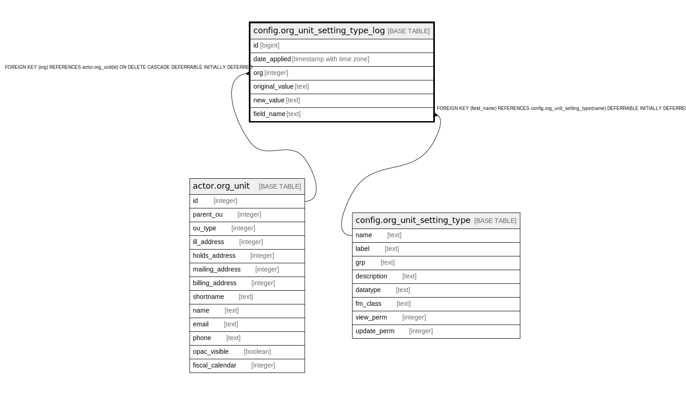

# config.org_unit_setting_type_log

## Description

  
Org Unit setting Logs  
  
This table contains the most recent changes to each setting   
in actor.org_unit_setting, allowing for mistakes to be undone.  
This is NOT meant to be an auditor, but rather an undo/redo.  

## Columns

| Name | Type | Default | Nullable | Children | Parents | Comment |
| ---- | ---- | ------- | -------- | -------- | ------- | ------- |
| id | bigint | nextval('config.org_unit_setting_type_log_id_seq'::regclass) | false |  |  |  |
| date_applied | timestamp with time zone | now() | false |  |  |  |
| org | integer |  | true |  | [actor.org_unit](actor.org_unit.md) |  |
| original_value | text |  | true |  |  |  |
| new_value | text |  | true |  |  |  |
| field_name | text |  | true |  | [config.org_unit_setting_type](config.org_unit_setting_type.md) |  |

## Constraints

| Name | Type | Definition |
| ---- | ---- | ---------- |
| config_org_unit_setting_type_log_fkey | FOREIGN KEY | FOREIGN KEY (org) REFERENCES actor.org_unit(id) ON DELETE CASCADE DEFERRABLE INITIALLY DEFERRED |
| org_unit_setting_type_log_pkey | PRIMARY KEY | PRIMARY KEY (id) |
| org_unit_setting_type_log_field_name_fkey | FOREIGN KEY | FOREIGN KEY (field_name) REFERENCES config.org_unit_setting_type(name) DEFERRABLE INITIALLY DEFERRED |

## Indexes

| Name | Definition |
| ---- | ---------- |
| org_unit_setting_type_log_pkey | CREATE UNIQUE INDEX org_unit_setting_type_log_pkey ON config.org_unit_setting_type_log USING btree (id) |

## Triggers

| Name | Definition |
| ---- | ---------- |
| limit_logs_oust | CREATE TRIGGER limit_logs_oust BEFORE INSERT OR UPDATE ON config.org_unit_setting_type_log FOR EACH ROW EXECUTE PROCEDURE limit_oustl() |

## Relations

---

> Generated by [tbls](https://github.com/k1LoW/tbls)
