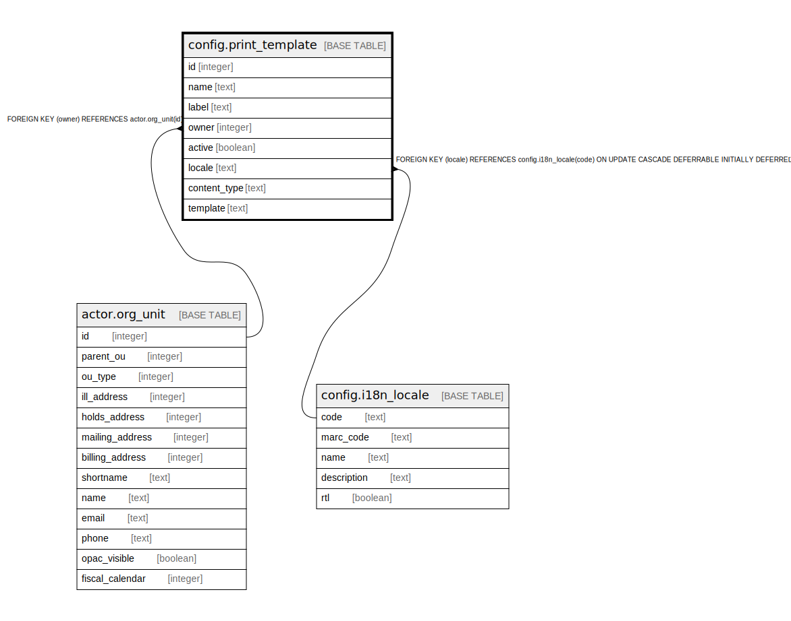

# config.print_template

## Description

## Columns

| Name | Type | Default | Nullable | Children | Parents | Comment |
| ---- | ---- | ------- | -------- | -------- | ------- | ------- |
| id | integer | nextval('config.print_template_id_seq'::regclass) | false |  |  |  |
| name | text |  | false |  |  |  |
| label | text |  | false |  |  |  |
| owner | integer |  | false |  | [actor.org_unit](actor.org_unit.md) |  |
| active | boolean | false | false |  |  |  |
| locale | text |  | true |  | [config.i18n_locale](config.i18n_locale.md) |  |
| content_type | text | 'text/html'::text | false |  |  |  |
| template | text |  | false |  |  |  |

## Constraints

| Name | Type | Definition |
| ---- | ---- | ---------- |
| print_template_owner_fkey | FOREIGN KEY | FOREIGN KEY (owner) REFERENCES actor.org_unit(id) |
| print_template_locale_fkey | FOREIGN KEY | FOREIGN KEY (locale) REFERENCES config.i18n_locale(code) ON UPDATE CASCADE DEFERRABLE INITIALLY DEFERRED |
| label_once_per_lib | UNIQUE | UNIQUE (owner, label) |
| name_once_per_lib | UNIQUE | UNIQUE (owner, name) |
| print_template_pkey | PRIMARY KEY | PRIMARY KEY (id) |

## Indexes

| Name | Definition |
| ---- | ---------- |
| label_once_per_lib | CREATE UNIQUE INDEX label_once_per_lib ON config.print_template USING btree (owner, label) |
| name_once_per_lib | CREATE UNIQUE INDEX name_once_per_lib ON config.print_template USING btree (owner, name) |
| print_template_pkey | CREATE UNIQUE INDEX print_template_pkey ON config.print_template USING btree (id) |

## Relations

---

> Generated by [tbls](https://github.com/k1LoW/tbls)
