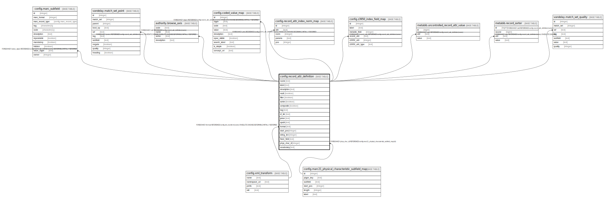

# config.record_attr_definition

## Description

## Columns

| Name | Type | Default | Nullable | Children | Parents | Comment |
| ---- | ---- | ------- | -------- | -------- | ------- | ------- |
| name | text |  | false | [config.marc_subfield](config.marc_subfield.md) [vandelay.match_set_point](vandelay.match_set_point.md) [authority.browse_axis](authority.browse_axis.md) [config.coded_value_map](config.coded_value_map.md) [config.record_attr_index_norm_map](config.record_attr_index_norm_map.md) [config.z3950_index_field_map](config.z3950_index_field_map.md) [metabib.uncontrolled_record_attr_value](metabib.uncontrolled_record_attr_value.md) [metabib.record_sorter](metabib.record_sorter.md) [vandelay.match_set_quality](vandelay.match_set_quality.md) |  |  |
| label | text |  | false |  |  |  |
| description | text |  | true |  |  |  |
| multi | boolean | true | false |  |  |  |
| filter | boolean | true | false |  |  |  |
| sorter | boolean | false | false |  |  |  |
| composite | boolean | false | false |  |  |  |
| tag | text |  | true |  |  |  |
| sf_list | text |  | true |  |  |  |
| joiner | text |  | true |  |  |  |
| xpath | text |  | true |  |  |  |
| format | text |  | true |  | [config.xml_transform](config.xml_transform.md) |  |
| start_pos | integer |  | true |  |  |  |
| string_len | integer |  | true |  |  |  |
| fixed_field | text |  | true |  |  |  |
| phys_char_sf | integer |  | true |  | [config.marc21_physical_characteristic_subfield_map](config.marc21_physical_characteristic_subfield_map.md) |  |
| vocabulary | text |  | true |  |  |  |

## Constraints

| Name | Type | Definition |
| ---- | ---- | ---------- |
| record_attr_definition_phys_char_sf_fkey | FOREIGN KEY | FOREIGN KEY (phys_char_sf) REFERENCES config.marc21_physical_characteristic_subfield_map(id) |
| record_attr_definition_pkey | PRIMARY KEY | PRIMARY KEY (name) |
| record_attr_definition_format_fkey | FOREIGN KEY | FOREIGN KEY (format) REFERENCES config.xml_transform(name) ON DELETE CASCADE DEFERRABLE INITIALLY DEFERRED |

## Indexes

| Name | Definition |
| ---- | ---------- |
| record_attr_definition_pkey | CREATE UNIQUE INDEX record_attr_definition_pkey ON config.record_attr_definition USING btree (name) |

## Relations

---

> Generated by [tbls](https://github.com/k1LoW/tbls)
