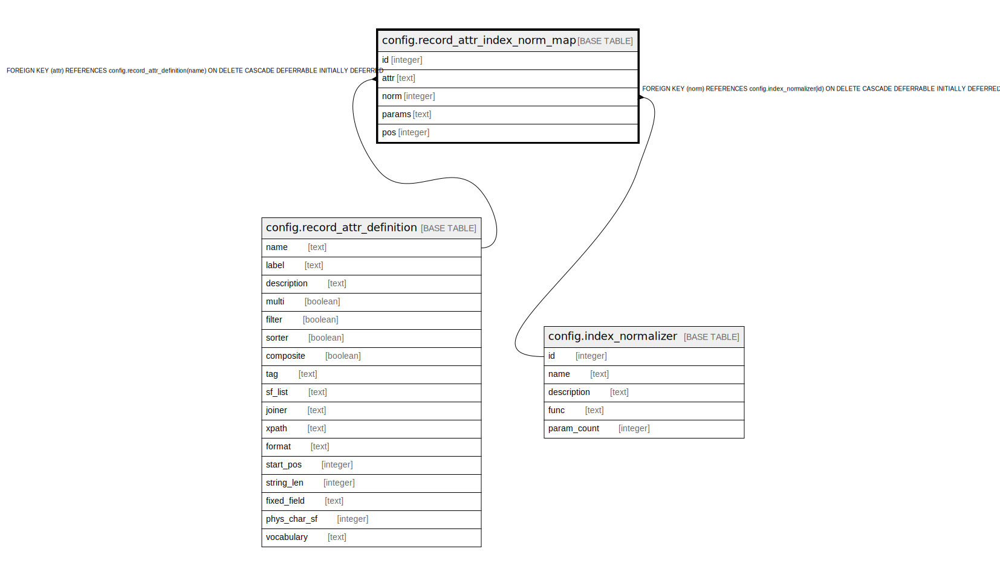

# config.record_attr_index_norm_map

## Description

## Columns

| Name | Type | Default | Nullable | Children | Parents | Comment |
| ---- | ---- | ------- | -------- | -------- | ------- | ------- |
| id | integer | nextval('config.record_attr_index_norm_map_id_seq'::regclass) | false |  |  |  |
| attr | text |  | false |  | [config.record_attr_definition](config.record_attr_definition.md) |  |
| norm | integer |  | false |  | [config.index_normalizer](config.index_normalizer.md) |  |
| params | text |  | true |  |  |  |
| pos | integer | 0 | false |  |  |  |

## Constraints

| Name | Type | Definition |
| ---- | ---- | ---------- |
| record_attr_index_norm_map_norm_fkey | FOREIGN KEY | FOREIGN KEY (norm) REFERENCES config.index_normalizer(id) ON DELETE CASCADE DEFERRABLE INITIALLY DEFERRED |
| record_attr_index_norm_map_attr_fkey | FOREIGN KEY | FOREIGN KEY (attr) REFERENCES config.record_attr_definition(name) ON DELETE CASCADE DEFERRABLE INITIALLY DEFERRED |
| record_attr_index_norm_map_pkey | PRIMARY KEY | PRIMARY KEY (id) |

## Indexes

| Name | Definition |
| ---- | ---------- |
| record_attr_index_norm_map_pkey | CREATE UNIQUE INDEX record_attr_index_norm_map_pkey ON config.record_attr_index_norm_map USING btree (id) |

## Relations

---

> Generated by [tbls](https://github.com/k1LoW/tbls)
