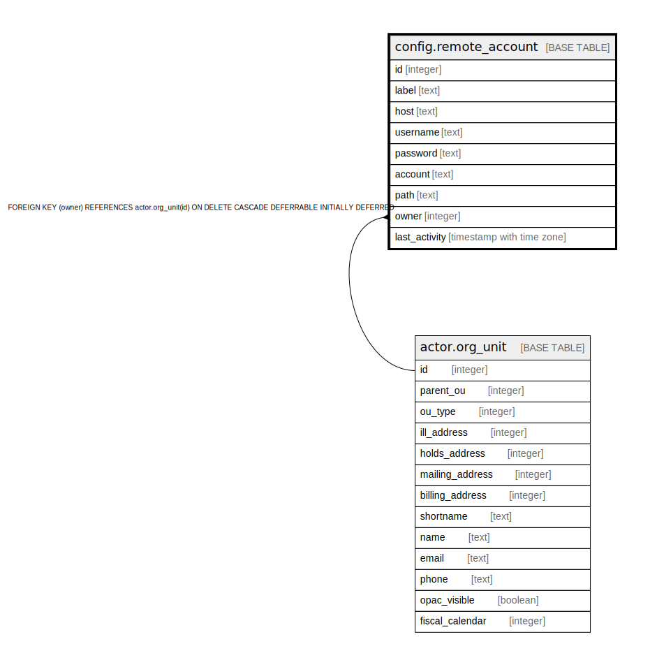

# config.remote_account

## Description

## Columns

| Name | Type | Default | Nullable | Children | Parents | Comment |
| ---- | ---- | ------- | -------- | -------- | ------- | ------- |
| id | integer | nextval('config.remote_account_id_seq'::regclass) | false |  |  |  |
| label | text |  | false |  |  |  |
| host | text |  | false |  |  |  |
| username | text |  | true |  |  |  |
| password | text |  | true |  |  |  |
| account | text |  | true |  |  |  |
| path | text |  | true |  |  |  |
| owner | integer |  | false |  | [actor.org_unit](actor.org_unit.md) |  |
| last_activity | timestamp with time zone |  | true |  |  |  |

## Constraints

| Name | Type | Definition |
| ---- | ---- | ---------- |
| config_remote_account_owner_fkey | FOREIGN KEY | FOREIGN KEY (owner) REFERENCES actor.org_unit(id) ON DELETE CASCADE DEFERRABLE INITIALLY DEFERRED |
| remote_account_pkey | PRIMARY KEY | PRIMARY KEY (id) |

## Indexes

| Name | Definition |
| ---- | ---------- |
| remote_account_pkey | CREATE UNIQUE INDEX remote_account_pkey ON config.remote_account USING btree (id) |

## Relations

---

> Generated by [tbls](https://github.com/k1LoW/tbls)
