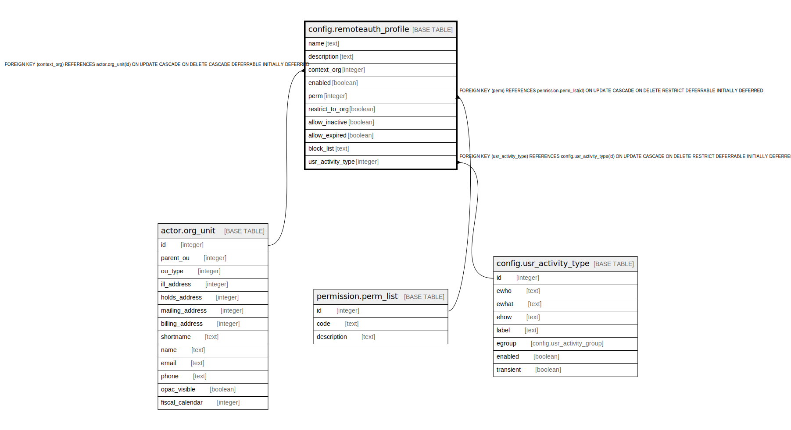

# config.remoteauth_profile

## Description

## Columns

| Name | Type | Default | Nullable | Children | Parents | Comment |
| ---- | ---- | ------- | -------- | -------- | ------- | ------- |
| name | text |  | false |  |  |  |
| description | text |  | true |  |  |  |
| context_org | integer |  | false |  | [actor.org_unit](actor.org_unit.md) |  |
| enabled | boolean | false | false |  |  |  |
| perm | integer |  | false |  | [permission.perm_list](permission.perm_list.md) |  |
| restrict_to_org | boolean | true | false |  |  |  |
| allow_inactive | boolean | false | false |  |  |  |
| allow_expired | boolean | false | false |  |  |  |
| block_list | text |  | true |  |  |  |
| usr_activity_type | integer |  | true |  | [config.usr_activity_type](config.usr_activity_type.md) |  |

## Constraints

| Name | Type | Definition |
| ---- | ---- | ---------- |
| remoteauth_profile_context_org_fkey | FOREIGN KEY | FOREIGN KEY (context_org) REFERENCES actor.org_unit(id) ON UPDATE CASCADE ON DELETE CASCADE DEFERRABLE INITIALLY DEFERRED |
| remoteauth_profile_pkey | PRIMARY KEY | PRIMARY KEY (name) |
| remoteauth_profile_usr_activity_type_fkey | FOREIGN KEY | FOREIGN KEY (usr_activity_type) REFERENCES config.usr_activity_type(id) ON UPDATE CASCADE ON DELETE RESTRICT DEFERRABLE INITIALLY DEFERRED |
| remoteauth_profile_perm_fkey | FOREIGN KEY | FOREIGN KEY (perm) REFERENCES permission.perm_list(id) ON UPDATE CASCADE ON DELETE RESTRICT DEFERRABLE INITIALLY DEFERRED |

## Indexes

| Name | Definition |
| ---- | ---------- |
| remoteauth_profile_pkey | CREATE UNIQUE INDEX remoteauth_profile_pkey ON config.remoteauth_profile USING btree (name) |

## Relations

---

> Generated by [tbls](https://github.com/k1LoW/tbls)
