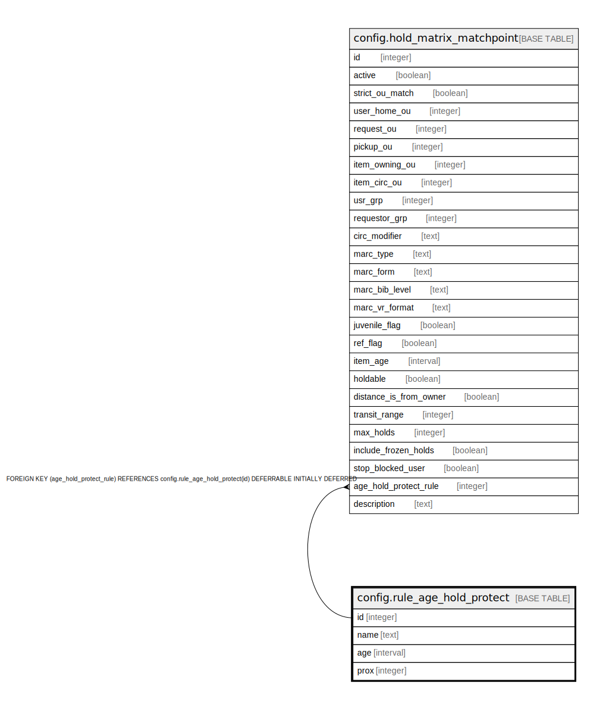

# config.rule_age_hold_protect

## Description

  
Hold Item Age Protection rules  
  
A hold request can only capture new(ish) items when they are  
within a particular proximity of the pickup_lib of the request.  
The proximity ('prox' column) is calculated by counting  
the number of tree edges between the pickup_lib and either the  
owning_lib or circ_lib of the copy that could fulfill the hold,  
as determined by the distance_is_from_owner value of the hold matrix  
rule controlling the hold request.  

## Columns

| Name | Type | Default | Nullable | Children | Parents | Comment |
| ---- | ---- | ------- | -------- | -------- | ------- | ------- |
| id | integer | nextval('config.rule_age_hold_protect_id_seq'::regclass) | false | [config.hold_matrix_matchpoint](config.hold_matrix_matchpoint.md) |  |  |
| name | text |  | false |  |  |  |
| age | interval |  | false |  |  |  |
| prox | integer |  | false |  |  |  |

## Constraints

| Name | Type | Definition |
| ---- | ---- | ---------- |
| rule_age_hold_protect_name_check | CHECK | CHECK ((name ~ '^\w+$'::text)) |
| rule_age_hold_protect_name_key | UNIQUE | UNIQUE (name) |
| rule_age_hold_protect_pkey | PRIMARY KEY | PRIMARY KEY (id) |

## Indexes

| Name | Definition |
| ---- | ---------- |
| rule_age_hold_protect_name_key | CREATE UNIQUE INDEX rule_age_hold_protect_name_key ON config.rule_age_hold_protect USING btree (name) |
| rule_age_hold_protect_pkey | CREATE UNIQUE INDEX rule_age_hold_protect_pkey ON config.rule_age_hold_protect USING btree (id) |

## Relations

---

> Generated by [tbls](https://github.com/k1LoW/tbls)
