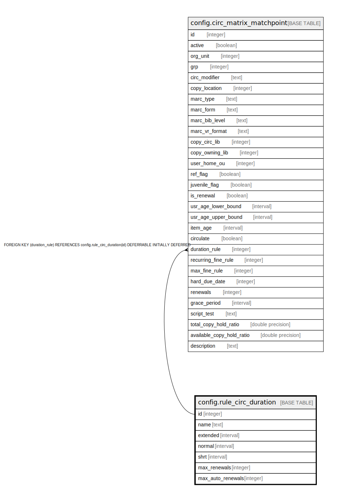

# config.rule_circ_duration

## Description

  
Circulation Duration rules  
  
Each circulation is given a duration based on one of these rules.  

## Columns

| Name | Type | Default | Nullable | Children | Parents | Comment |
| ---- | ---- | ------- | -------- | -------- | ------- | ------- |
| id | integer | nextval('config.rule_circ_duration_id_seq'::regclass) | false | [config.circ_matrix_matchpoint](config.circ_matrix_matchpoint.md) |  |  |
| name | text |  | false |  |  |  |
| extended | interval |  | false |  |  |  |
| normal | interval |  | false |  |  |  |
| shrt | interval |  | false |  |  |  |
| max_renewals | integer |  | false |  |  |  |
| max_auto_renewals | integer |  | true |  |  |  |

## Constraints

| Name | Type | Definition |
| ---- | ---- | ---------- |
| rule_circ_duration_name_check | CHECK | CHECK ((name ~ '^\w+$'::text)) |
| rule_circ_duration_name_key | UNIQUE | UNIQUE (name) |
| rule_circ_duration_pkey | PRIMARY KEY | PRIMARY KEY (id) |

## Indexes

| Name | Definition |
| ---- | ---------- |
| rule_circ_duration_name_key | CREATE UNIQUE INDEX rule_circ_duration_name_key ON config.rule_circ_duration USING btree (name) |
| rule_circ_duration_pkey | CREATE UNIQUE INDEX rule_circ_duration_pkey ON config.rule_circ_duration USING btree (id) |

## Relations

---

> Generated by [tbls](https://github.com/k1LoW/tbls)
