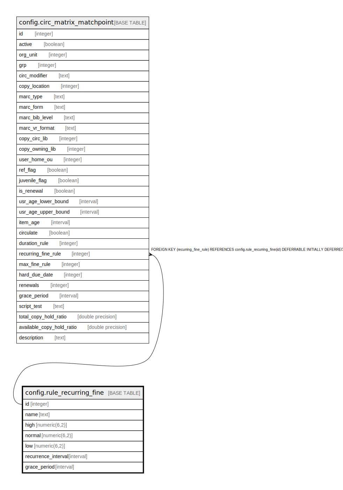

# config.rule_recurring_fine

## Description

  
Circulation Recurring Fine rules  
  
Each circulation is given a recurring fine amount based on one of  
these rules.  Note that it is recommended to run the fine generator  
(from cron) at least as frequently as the lowest recurrence interval  
used by your circulation rules so that accrued fines will be up  
to date.  

## Columns

| Name | Type | Default | Nullable | Children | Parents | Comment |
| ---- | ---- | ------- | -------- | -------- | ------- | ------- |
| id | integer | nextval('config.rule_recurring_fine_id_seq'::regclass) | false | [config.circ_matrix_matchpoint](config.circ_matrix_matchpoint.md) |  |  |
| name | text |  | false |  |  |  |
| high | numeric(6,2) |  | false |  |  |  |
| normal | numeric(6,2) |  | false |  |  |  |
| low | numeric(6,2) |  | false |  |  |  |
| recurrence_interval | interval | '1 day'::interval | false |  |  |  |
| grace_period | interval | '1 day'::interval | false |  |  |  |

## Constraints

| Name | Type | Definition |
| ---- | ---- | ---------- |
| rule_recurring_fine_name_check | CHECK | CHECK ((name ~ '^\w+$'::text)) |
| rule_recurring_fine_name_key | UNIQUE | UNIQUE (name) |
| rule_recurring_fine_pkey | PRIMARY KEY | PRIMARY KEY (id) |

## Indexes

| Name | Definition |
| ---- | ---------- |
| rule_recurring_fine_name_key | CREATE UNIQUE INDEX rule_recurring_fine_name_key ON config.rule_recurring_fine USING btree (name) |
| rule_recurring_fine_pkey | CREATE UNIQUE INDEX rule_recurring_fine_pkey ON config.rule_recurring_fine USING btree (id) |

## Relations

---

> Generated by [tbls](https://github.com/k1LoW/tbls)
