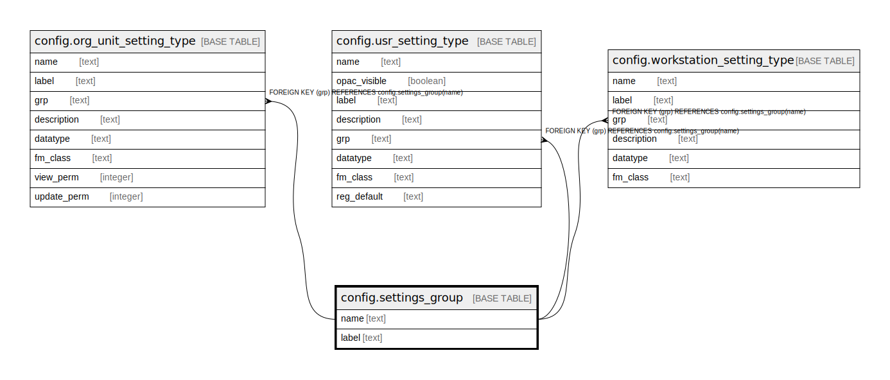

# config.settings_group

## Description

## Columns

| Name | Type | Default | Nullable | Children | Parents | Comment |
| ---- | ---- | ------- | -------- | -------- | ------- | ------- |
| name | text |  | false | [config.org_unit_setting_type](config.org_unit_setting_type.md) [config.usr_setting_type](config.usr_setting_type.md) [config.workstation_setting_type](config.workstation_setting_type.md) |  |  |
| label | text |  | false |  |  |  |

## Constraints

| Name | Type | Definition |
| ---- | ---- | ---------- |
| settings_group_label_key | UNIQUE | UNIQUE (label) |
| settings_group_pkey | PRIMARY KEY | PRIMARY KEY (name) |

## Indexes

| Name | Definition |
| ---- | ---------- |
| settings_group_label_key | CREATE UNIQUE INDEX settings_group_label_key ON config.settings_group USING btree (label) |
| settings_group_pkey | CREATE UNIQUE INDEX settings_group_pkey ON config.settings_group USING btree (name) |

## Relations

---

> Generated by [tbls](https://github.com/k1LoW/tbls)
