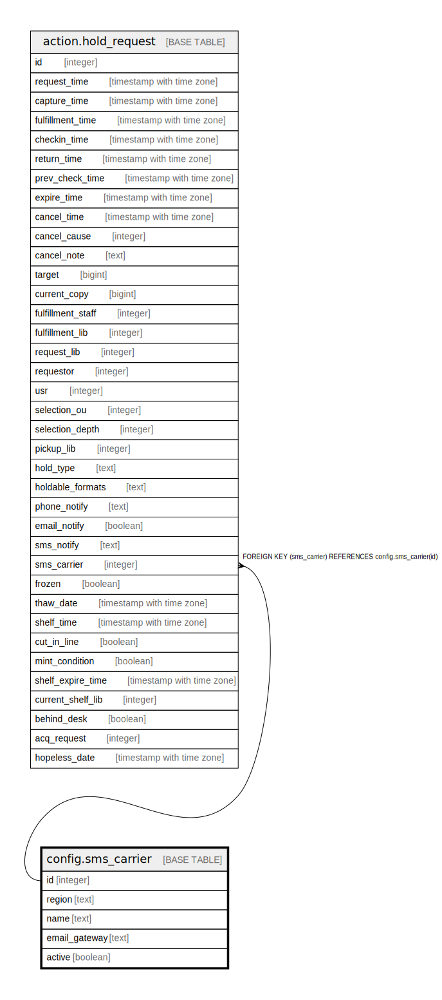

# config.sms_carrier

## Description

## Columns

| Name | Type | Default | Nullable | Children | Parents | Comment |
| ---- | ---- | ------- | -------- | -------- | ------- | ------- |
| id | integer | nextval('config.sms_carrier_id_seq'::regclass) | false | [action.hold_request](action.hold_request.md) |  |  |
| region | text |  | true |  |  |  |
| name | text |  | true |  |  |  |
| email_gateway | text |  | true |  |  |  |
| active | boolean | true | true |  |  |  |

## Constraints

| Name | Type | Definition |
| ---- | ---- | ---------- |
| sms_carrier_pkey | PRIMARY KEY | PRIMARY KEY (id) |

## Indexes

| Name | Definition |
| ---- | ---------- |
| sms_carrier_pkey | CREATE UNIQUE INDEX sms_carrier_pkey ON config.sms_carrier USING btree (id) |

## Relations

---

> Generated by [tbls](https://github.com/k1LoW/tbls)
