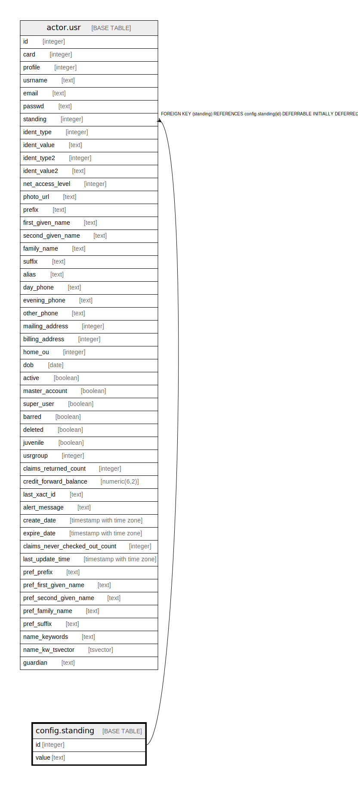

# config.standing

## Description

  
Patron Standings  
  
This table contains the values that can be applied to a patron  
by a staff member.  These values should not be changed, other  
than for translation, as the ID column is currently a "magic  
number" in the source. :(  

## Columns

| Name | Type | Default | Nullable | Children | Parents | Comment |
| ---- | ---- | ------- | -------- | -------- | ------- | ------- |
| id | integer | nextval('config.standing_id_seq'::regclass) | false | [actor.usr](actor.usr.md) |  |  |
| value | text |  | false |  |  |  |

## Constraints

| Name | Type | Definition |
| ---- | ---- | ---------- |
| standing_pkey | PRIMARY KEY | PRIMARY KEY (id) |
| standing_value_key | UNIQUE | UNIQUE (value) |

## Indexes

| Name | Definition |
| ---- | ---------- |
| standing_pkey | CREATE UNIQUE INDEX standing_pkey ON config.standing USING btree (id) |
| standing_value_key | CREATE UNIQUE INDEX standing_value_key ON config.standing USING btree (value) |

## Relations

---

> Generated by [tbls](https://github.com/k1LoW/tbls)
