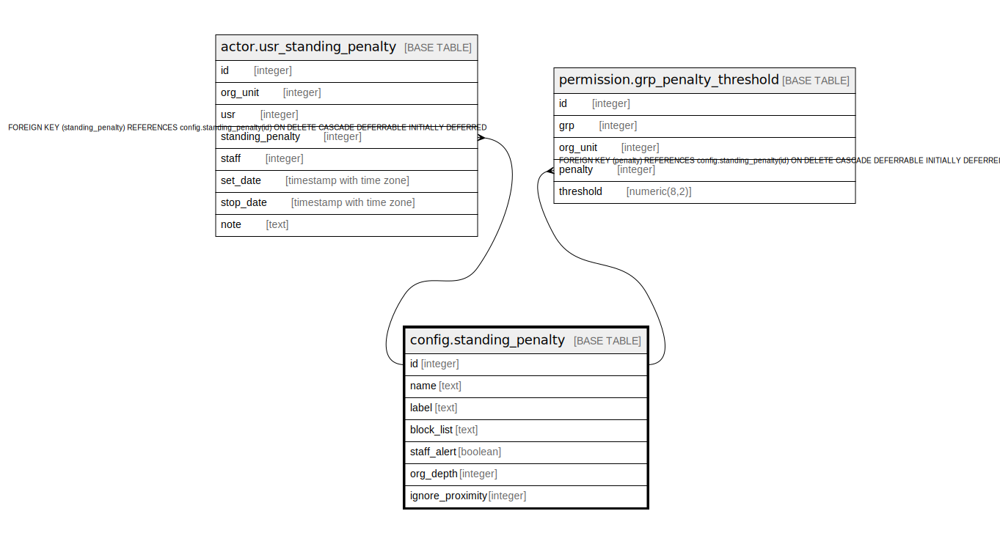

# config.standing_penalty

## Description

## Columns

| Name | Type | Default | Nullable | Children | Parents | Comment |
| ---- | ---- | ------- | -------- | -------- | ------- | ------- |
| id | integer | nextval('config.standing_penalty_id_seq'::regclass) | false | [actor.usr_standing_penalty](actor.usr_standing_penalty.md) [permission.grp_penalty_threshold](permission.grp_penalty_threshold.md) |  |  |
| name | text |  | false |  |  |  |
| label | text |  | false |  |  |  |
| block_list | text |  | true |  |  |  |
| staff_alert | boolean | false | false |  |  |  |
| org_depth | integer |  | true |  |  |  |
| ignore_proximity | integer |  | true |  |  |  |

## Constraints

| Name | Type | Definition |
| ---- | ---- | ---------- |
| standing_penalty_name_key | UNIQUE | UNIQUE (name) |
| standing_penalty_pkey | PRIMARY KEY | PRIMARY KEY (id) |

## Indexes

| Name | Definition |
| ---- | ---------- |
| standing_penalty_name_key | CREATE UNIQUE INDEX standing_penalty_name_key ON config.standing_penalty USING btree (name) |
| standing_penalty_pkey | CREATE UNIQUE INDEX standing_penalty_pkey ON config.standing_penalty USING btree (id) |

## Relations

---

> Generated by [tbls](https://github.com/k1LoW/tbls)
