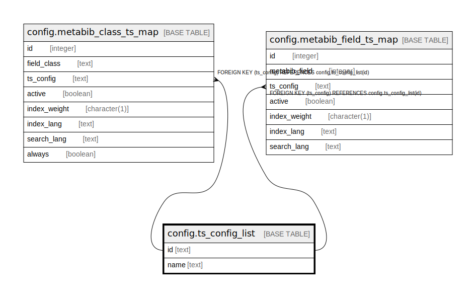

# config.ts_config_list

## Description

  
Full Text Configs  
  
A list of full text configs with names and descriptions.  

## Columns

| Name | Type | Default | Nullable | Children | Parents | Comment |
| ---- | ---- | ------- | -------- | -------- | ------- | ------- |
| id | text |  | false | [config.metabib_class_ts_map](config.metabib_class_ts_map.md) [config.metabib_field_ts_map](config.metabib_field_ts_map.md) |  |  |
| name | text |  | false |  |  |  |

## Constraints

| Name | Type | Definition |
| ---- | ---- | ---------- |
| ts_config_list_pkey | PRIMARY KEY | PRIMARY KEY (id) |

## Indexes

| Name | Definition |
| ---- | ---------- |
| ts_config_list_pkey | CREATE UNIQUE INDEX ts_config_list_pkey ON config.ts_config_list USING btree (id) |

## Relations

---

> Generated by [tbls](https://github.com/k1LoW/tbls)
