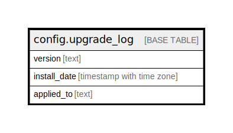

# config.upgrade_log

## Description

## Columns

| Name | Type | Default | Nullable | Children | Parents | Comment |
| ---- | ---- | ------- | -------- | -------- | ------- | ------- |
| version | text |  | false |  |  |  |
| install_date | timestamp with time zone | now() | false |  |  |  |
| applied_to | text |  | true |  |  |  |

## Constraints

| Name | Type | Definition |
| ---- | ---- | ---------- |
| upgrade_log_pkey | PRIMARY KEY | PRIMARY KEY (version) |

## Indexes

| Name | Definition |
| ---- | ---------- |
| upgrade_log_pkey | CREATE UNIQUE INDEX upgrade_log_pkey ON config.upgrade_log USING btree (version) |

## Relations

---

> Generated by [tbls](https://github.com/k1LoW/tbls)
