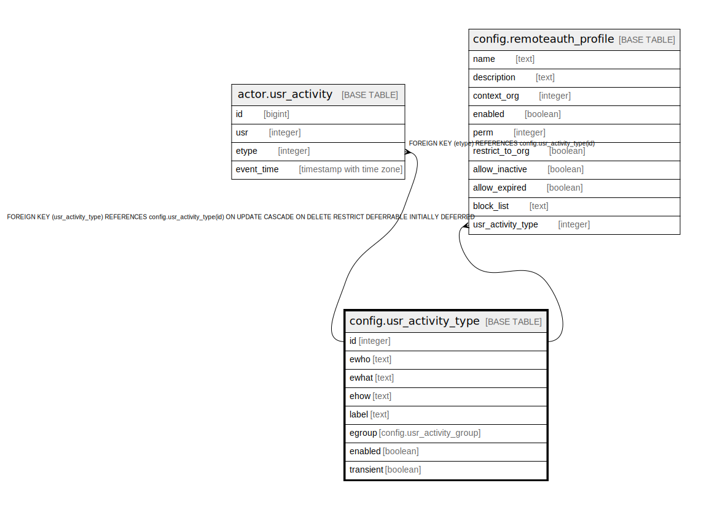

# config.usr_activity_type

## Description

## Columns

| Name | Type | Default | Nullable | Children | Parents | Comment |
| ---- | ---- | ------- | -------- | -------- | ------- | ------- |
| id | integer | nextval('config.usr_activity_type_id_seq'::regclass) | false | [actor.usr_activity](actor.usr_activity.md) [config.remoteauth_profile](config.remoteauth_profile.md) |  |  |
| ewho | text |  | true |  |  |  |
| ewhat | text |  | true |  |  |  |
| ehow | text |  | true |  |  |  |
| label | text |  | false |  |  |  |
| egroup | config.usr_activity_group |  | false |  |  |  |
| enabled | boolean | true | false |  |  |  |
| transient | boolean | true | false |  |  |  |

## Constraints

| Name | Type | Definition |
| ---- | ---- | ---------- |
| one_of_wwh | CHECK | CHECK ((COALESCE(ewho, ewhat, ehow) IS NOT NULL)) |
| usr_activity_type_pkey | PRIMARY KEY | PRIMARY KEY (id) |

## Indexes

| Name | Definition |
| ---- | ---------- |
| usr_activity_type_pkey | CREATE UNIQUE INDEX usr_activity_type_pkey ON config.usr_activity_type USING btree (id) |
| unique_wwh | CREATE UNIQUE INDEX unique_wwh ON config.usr_activity_type USING btree (COALESCE(ewho, ''::text), COALESCE(ewhat, ''::text), COALESCE(ehow, ''::text)) |

## Relations

---

> Generated by [tbls](https://github.com/k1LoW/tbls)
