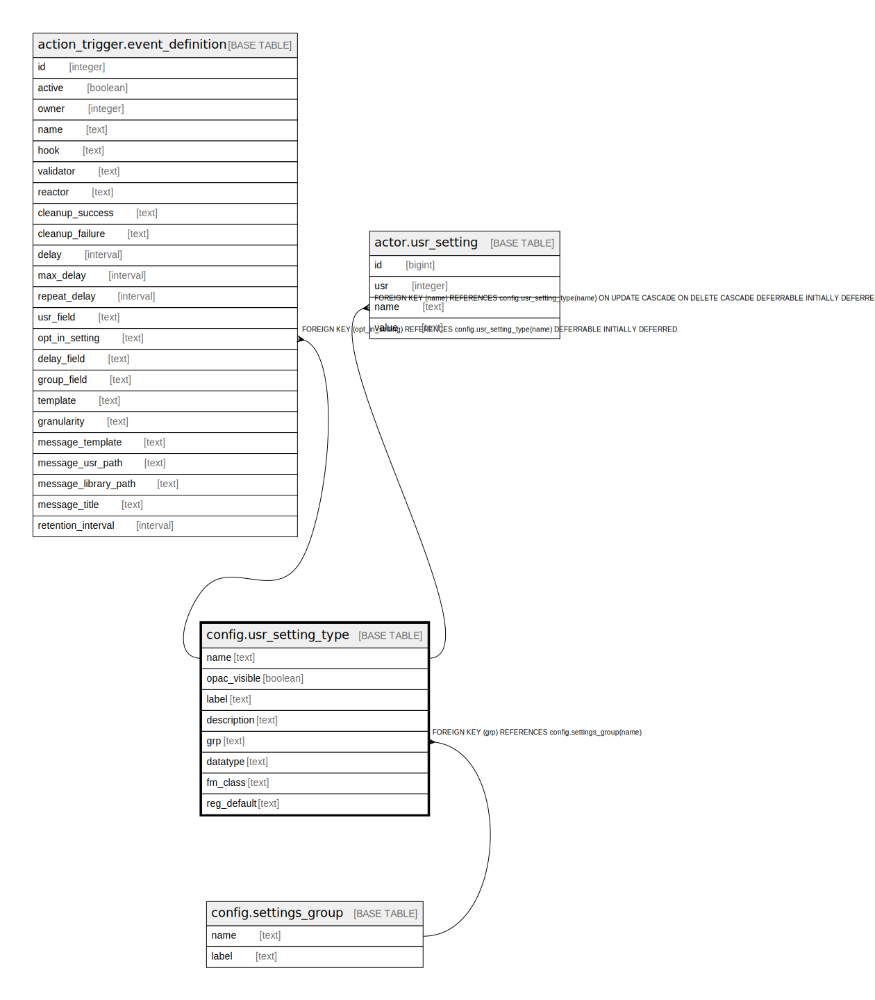

# config.usr_setting_type

## Description

## Columns

| Name | Type | Default | Nullable | Children | Parents | Comment |
| ---- | ---- | ------- | -------- | -------- | ------- | ------- |
| name | text |  | false | [action_trigger.event_definition](action_trigger.event_definition.md) [actor.usr_setting](actor.usr_setting.md) |  |  |
| opac_visible | boolean | false | false |  |  |  |
| label | text |  | false |  |  |  |
| description | text |  | true |  |  |  |
| grp | text |  | true |  | [config.settings_group](config.settings_group.md) |  |
| datatype | text | 'string'::text | false |  |  |  |
| fm_class | text |  | true |  |  |  |
| reg_default | text |  | true |  |  |  |

## Constraints

| Name | Type | Definition |
| ---- | ---- | ---------- |
| check_setting_is_usr_or_ws | TRIGGER | CREATE CONSTRAINT TRIGGER check_setting_is_usr_or_ws AFTER INSERT OR UPDATE ON config.usr_setting_type NOT DEFERRABLE INITIALLY IMMEDIATE FOR EACH ROW EXECUTE PROCEDURE config.setting_is_user_or_ws() |
| coust_no_empty_link | CHECK | CHECK ((((datatype = 'link'::text) AND (fm_class IS NOT NULL)) OR ((datatype <> 'link'::text) AND (fm_class IS NULL)))) |
| coust_valid_datatype | CHECK | CHECK ((datatype = ANY (ARRAY['bool'::text, 'integer'::text, 'float'::text, 'currency'::text, 'interval'::text, 'date'::text, 'string'::text, 'object'::text, 'array'::text, 'link'::text]))) |
| usr_setting_type_grp_fkey | FOREIGN KEY | FOREIGN KEY (grp) REFERENCES config.settings_group(name) |
| usr_setting_type_label_key | UNIQUE | UNIQUE (label) |
| usr_setting_type_pkey | PRIMARY KEY | PRIMARY KEY (name) |

## Indexes

| Name | Definition |
| ---- | ---------- |
| usr_setting_type_label_key | CREATE UNIQUE INDEX usr_setting_type_label_key ON config.usr_setting_type USING btree (label) |
| usr_setting_type_pkey | CREATE UNIQUE INDEX usr_setting_type_pkey ON config.usr_setting_type USING btree (name) |

## Triggers

| Name | Definition |
| ---- | ---------- |
| check_setting_is_usr_or_ws | CREATE CONSTRAINT TRIGGER check_setting_is_usr_or_ws AFTER INSERT OR UPDATE ON config.usr_setting_type NOT DEFERRABLE INITIALLY IMMEDIATE FOR EACH ROW EXECUTE PROCEDURE config.setting_is_user_or_ws() |

## Relations

---

> Generated by [tbls](https://github.com/k1LoW/tbls)
