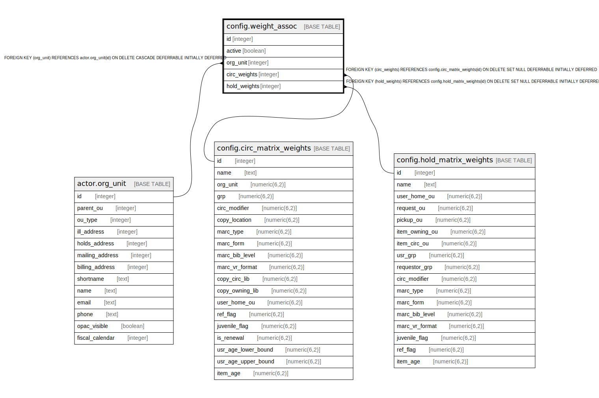

# config.weight_assoc

## Description

## Columns

| Name | Type | Default | Nullable | Children | Parents | Comment |
| ---- | ---- | ------- | -------- | -------- | ------- | ------- |
| id | integer | nextval('config.weight_assoc_id_seq'::regclass) | false |  |  |  |
| active | boolean |  | false |  |  |  |
| org_unit | integer |  | false |  | [actor.org_unit](actor.org_unit.md) |  |
| circ_weights | integer |  | true |  | [config.circ_matrix_weights](config.circ_matrix_weights.md) |  |
| hold_weights | integer |  | true |  | [config.hold_matrix_weights](config.hold_matrix_weights.md) |  |

## Constraints

| Name | Type | Definition |
| ---- | ---- | ---------- |
| weight_assoc_org_unit_fkey | FOREIGN KEY | FOREIGN KEY (org_unit) REFERENCES actor.org_unit(id) ON DELETE CASCADE DEFERRABLE INITIALLY DEFERRED |
| weight_assoc_circ_weights_fkey | FOREIGN KEY | FOREIGN KEY (circ_weights) REFERENCES config.circ_matrix_weights(id) ON DELETE SET NULL DEFERRABLE INITIALLY DEFERRED |
| weight_assoc_hold_weights_fkey | FOREIGN KEY | FOREIGN KEY (hold_weights) REFERENCES config.hold_matrix_weights(id) ON DELETE SET NULL DEFERRABLE INITIALLY DEFERRED |
| weight_assoc_pkey | PRIMARY KEY | PRIMARY KEY (id) |

## Indexes

| Name | Definition |
| ---- | ---------- |
| weight_assoc_pkey | CREATE UNIQUE INDEX weight_assoc_pkey ON config.weight_assoc USING btree (id) |
| cwa_one_active_per_ou | CREATE UNIQUE INDEX cwa_one_active_per_ou ON config.weight_assoc USING btree (org_unit) WHERE active |

## Relations

---

> Generated by [tbls](https://github.com/k1LoW/tbls)
