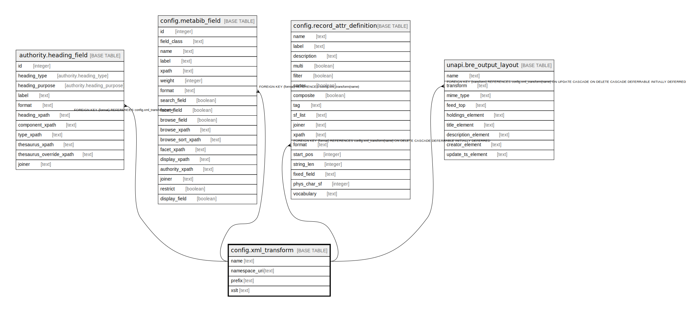

# config.xml_transform

## Description

## Columns

| Name | Type | Default | Nullable | Children | Parents | Comment |
| ---- | ---- | ------- | -------- | -------- | ------- | ------- |
| name | text |  | false | [authority.heading_field](authority.heading_field.md) [config.metabib_field](config.metabib_field.md) [config.record_attr_definition](config.record_attr_definition.md) [unapi.bre_output_layout](unapi.bre_output_layout.md) |  |  |
| namespace_uri | text |  | false |  |  |  |
| prefix | text |  | false |  |  |  |
| xslt | text |  | false |  |  |  |

## Constraints

| Name | Type | Definition |
| ---- | ---- | ---------- |
| xml_transform_pkey | PRIMARY KEY | PRIMARY KEY (name) |

## Indexes

| Name | Definition |
| ---- | ---------- |
| xml_transform_pkey | CREATE UNIQUE INDEX xml_transform_pkey ON config.xml_transform USING btree (name) |

## Relations

---

> Generated by [tbls](https://github.com/k1LoW/tbls)
