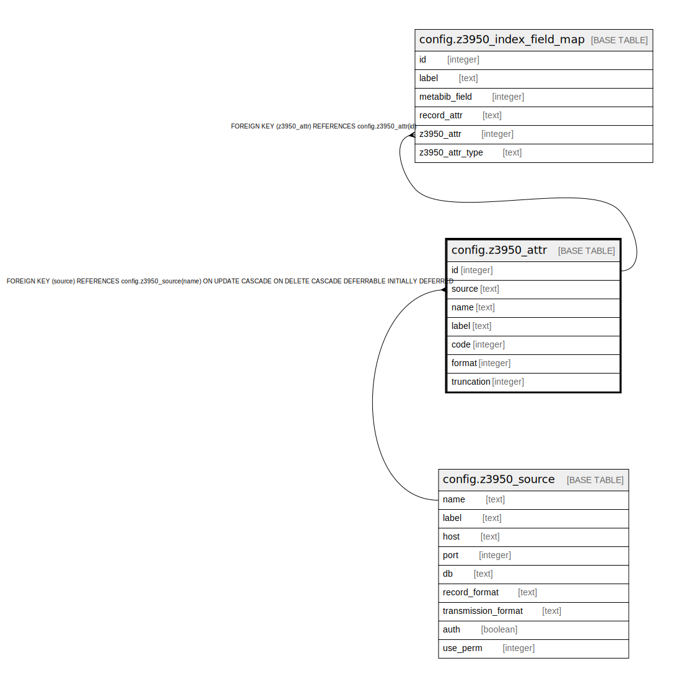

# config.z3950_attr

## Description

## Columns

| Name | Type | Default | Nullable | Children | Parents | Comment |
| ---- | ---- | ------- | -------- | -------- | ------- | ------- |
| id | integer | nextval('config.z3950_attr_id_seq'::regclass) | false | [config.z3950_index_field_map](config.z3950_index_field_map.md) |  |  |
| source | text |  | false |  | [config.z3950_source](config.z3950_source.md) |  |
| name | text |  | false |  |  |  |
| label | text |  | false |  |  |  |
| code | integer |  | false |  |  |  |
| format | integer |  | false |  |  |  |
| truncation | integer | 0 | false |  |  |  |

## Constraints

| Name | Type | Definition |
| ---- | ---- | ---------- |
| z3950_attr_pkey | PRIMARY KEY | PRIMARY KEY (id) |
| z3950_attr_source_fkey | FOREIGN KEY | FOREIGN KEY (source) REFERENCES config.z3950_source(name) ON UPDATE CASCADE ON DELETE CASCADE DEFERRABLE INITIALLY DEFERRED |
| z_code_format_once_per_source | UNIQUE | UNIQUE (code, format, source) |

## Indexes

| Name | Definition |
| ---- | ---------- |
| z3950_attr_pkey | CREATE UNIQUE INDEX z3950_attr_pkey ON config.z3950_attr USING btree (id) |
| z_code_format_once_per_source | CREATE UNIQUE INDEX z_code_format_once_per_source ON config.z3950_attr USING btree (code, format, source) |

## Relations

---

> Generated by [tbls](https://github.com/k1LoW/tbls)
