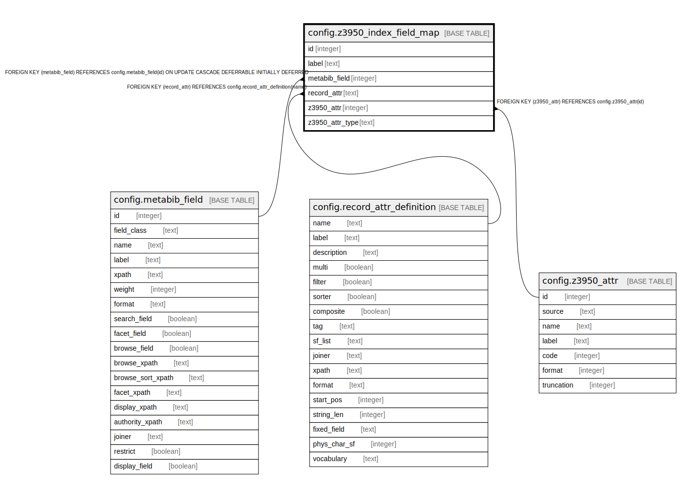

# config.z3950_index_field_map

## Description

## Columns

| Name | Type | Default | Nullable | Children | Parents | Comment |
| ---- | ---- | ------- | -------- | -------- | ------- | ------- |
| id | integer | nextval('config.z3950_index_field_map_id_seq'::regclass) | false |  |  |  |
| label | text |  | false |  |  |  |
| metabib_field | integer |  | true |  | [config.metabib_field](config.metabib_field.md) |  |
| record_attr | text |  | true |  | [config.record_attr_definition](config.record_attr_definition.md) |  |
| z3950_attr | integer |  | true |  | [config.z3950_attr](config.z3950_attr.md) |  |
| z3950_attr_type | text |  | true |  |  |  |

## Constraints

| Name | Type | Definition |
| ---- | ---- | ---------- |
| attr_or_attr_type | CHECK | CHECK (((z3950_attr IS NOT NULL) OR (z3950_attr_type IS NOT NULL))) |
| metabib_field_or_record_attr | CHECK | CHECK (((metabib_field IS NOT NULL) OR (record_attr IS NOT NULL))) |
| valid_z3950_attr_type | TRIGGER | CREATE CONSTRAINT TRIGGER valid_z3950_attr_type AFTER INSERT OR UPDATE ON config.z3950_index_field_map DEFERRABLE INITIALLY DEFERRED FOR EACH ROW WHEN ((new.z3950_attr_type IS NOT NULL)) EXECUTE PROCEDURE z3950_attr_name_is_valid() |
| z3950_index_field_map_metabib_field_fkey | FOREIGN KEY | FOREIGN KEY (metabib_field) REFERENCES config.metabib_field(id) ON UPDATE CASCADE DEFERRABLE INITIALLY DEFERRED |
| z3950_index_field_map_record_attr_fkey | FOREIGN KEY | FOREIGN KEY (record_attr) REFERENCES config.record_attr_definition(name) |
| z3950_index_field_map_z3950_attr_fkey | FOREIGN KEY | FOREIGN KEY (z3950_attr) REFERENCES config.z3950_attr(id) |
| z3950_index_field_map_pkey | PRIMARY KEY | PRIMARY KEY (id) |

## Indexes

| Name | Definition |
| ---- | ---------- |
| z3950_index_field_map_pkey | CREATE UNIQUE INDEX z3950_index_field_map_pkey ON config.z3950_index_field_map USING btree (id) |

## Triggers

| Name | Definition |
| ---- | ---------- |
| valid_z3950_attr_type | CREATE CONSTRAINT TRIGGER valid_z3950_attr_type AFTER INSERT OR UPDATE ON config.z3950_index_field_map DEFERRABLE INITIALLY DEFERRED FOR EACH ROW WHEN ((new.z3950_attr_type IS NOT NULL)) EXECUTE PROCEDURE z3950_attr_name_is_valid() |

## Relations

---

> Generated by [tbls](https://github.com/k1LoW/tbls)
