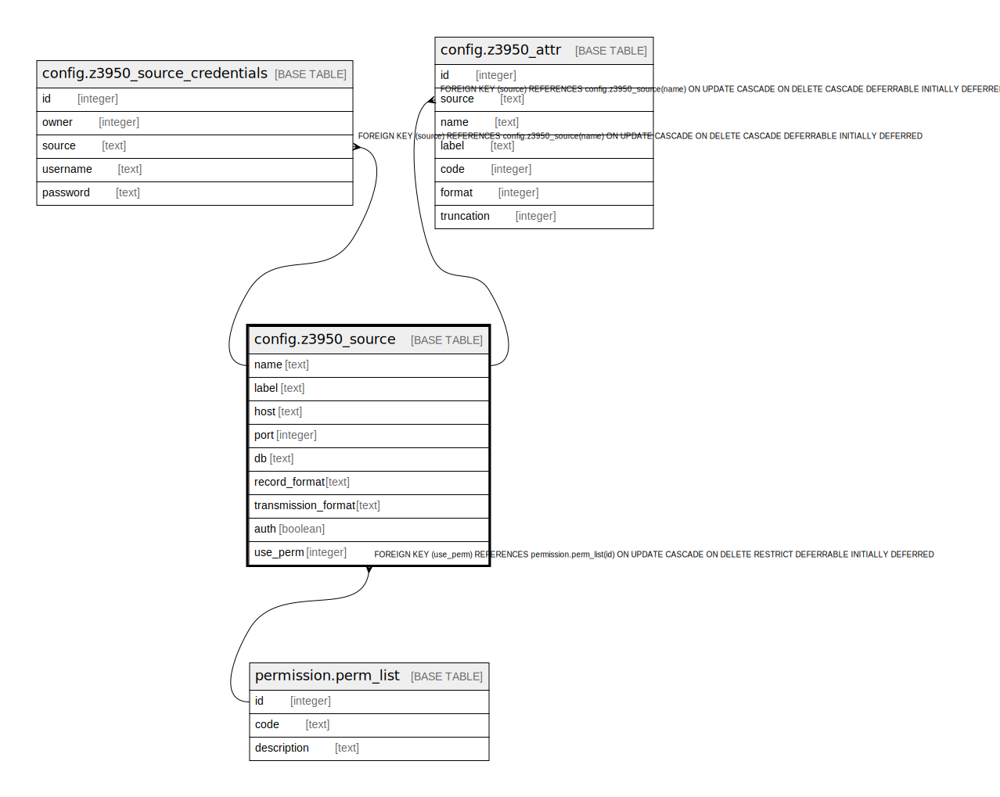

# config.z3950_source

## Description

  
Z39.50 Sources  
  
Each row in this table represents a database searchable via Z39.50.  

## Columns

| Name | Type | Default | Nullable | Children | Parents | Comment |
| ---- | ---- | ------- | -------- | -------- | ------- | ------- |
| name | text |  | false | [config.z3950_source_credentials](config.z3950_source_credentials.md) [config.z3950_attr](config.z3950_attr.md) |  |  |
| label | text |  | false |  |  |  |
| host | text |  | false |  |  |  |
| port | integer |  | false |  |  |  |
| db | text |  | false |  |  |  |
| record_format | text | 'FI'::text | false |  |  |  Z39.50 element set.  |
| transmission_format | text | 'usmarc'::text | false |  |  |  Z39.50 preferred record syntax..  |
| auth | boolean | true | false |  |  |  |
| use_perm | integer |  | true |  | [permission.perm_list](permission.perm_list.md) |  If set, this permission is required for the source to be listed in the staff client Z39.50 interface.  Similar to permission.grp_tree.application_perm.  |

## Constraints

| Name | Type | Definition |
| ---- | ---- | ---------- |
| z3950_source_label_key | UNIQUE | UNIQUE (label) |
| z3950_source_pkey | PRIMARY KEY | PRIMARY KEY (name) |
| use_perm_fkey | FOREIGN KEY | FOREIGN KEY (use_perm) REFERENCES permission.perm_list(id) ON UPDATE CASCADE ON DELETE RESTRICT DEFERRABLE INITIALLY DEFERRED |

## Indexes

| Name | Definition |
| ---- | ---------- |
| z3950_source_label_key | CREATE UNIQUE INDEX z3950_source_label_key ON config.z3950_source USING btree (label) |
| z3950_source_pkey | CREATE UNIQUE INDEX z3950_source_pkey ON config.z3950_source USING btree (name) |

## Relations

---

> Generated by [tbls](https://github.com/k1LoW/tbls)
