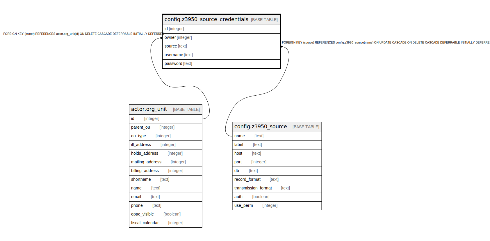

# config.z3950_source_credentials

## Description

## Columns

| Name | Type | Default | Nullable | Children | Parents | Comment |
| ---- | ---- | ------- | -------- | -------- | ------- | ------- |
| id | integer | nextval('config.z3950_source_credentials_id_seq'::regclass) | false |  |  |  |
| owner | integer |  | false |  | [actor.org_unit](actor.org_unit.md) |  |
| source | text |  | false |  | [config.z3950_source](config.z3950_source.md) |  |
| username | text |  | true |  |  |  |
| password | text |  | true |  |  |  |

## Constraints

| Name | Type | Definition |
| ---- | ---- | ---------- |
| z3950_source_creds_owner_fkey | FOREIGN KEY | FOREIGN KEY (owner) REFERENCES actor.org_unit(id) ON DELETE CASCADE DEFERRABLE INITIALLY DEFERRED |
| czsc_source_once_per_lib | UNIQUE | UNIQUE (source, owner) |
| z3950_source_credentials_pkey | PRIMARY KEY | PRIMARY KEY (id) |
| z3950_source_credentials_source_fkey | FOREIGN KEY | FOREIGN KEY (source) REFERENCES config.z3950_source(name) ON UPDATE CASCADE ON DELETE CASCADE DEFERRABLE INITIALLY DEFERRED |

## Indexes

| Name | Definition |
| ---- | ---------- |
| czsc_source_once_per_lib | CREATE UNIQUE INDEX czsc_source_once_per_lib ON config.z3950_source_credentials USING btree (source, owner) |
| z3950_source_credentials_pkey | CREATE UNIQUE INDEX z3950_source_credentials_pkey ON config.z3950_source_credentials USING btree (id) |

## Relations

---

> Generated by [tbls](https://github.com/k1LoW/tbls)
