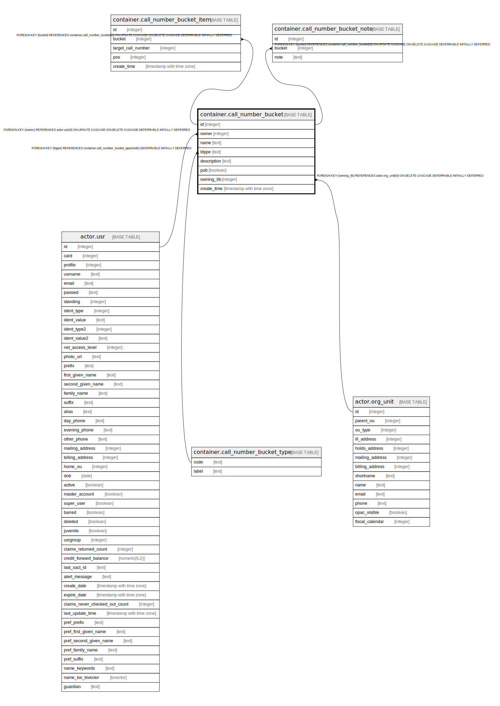

# container.call_number_bucket

## Description

## Columns

| Name | Type | Default | Nullable | Children | Parents | Comment |
| ---- | ---- | ------- | -------- | -------- | ------- | ------- |
| id | integer | nextval('container.call_number_bucket_id_seq'::regclass) | false | [container.call_number_bucket_item](container.call_number_bucket_item.md) [container.call_number_bucket_note](container.call_number_bucket_note.md) |  |  |
| owner | integer |  | false |  | [actor.usr](actor.usr.md) |  |
| name | text |  | false |  |  |  |
| btype | text | 'misc'::text | false |  | [container.call_number_bucket_type](container.call_number_bucket_type.md) |  |
| description | text |  | true |  |  |  |
| pub | boolean | false | false |  |  |  |
| owning_lib | integer |  | true |  | [actor.org_unit](actor.org_unit.md) |  |
| create_time | timestamp with time zone | now() | false |  |  |  |

## Constraints

| Name | Type | Definition |
| ---- | ---- | ---------- |
| call_number_bucket_owning_lib_fkey | FOREIGN KEY | FOREIGN KEY (owning_lib) REFERENCES actor.org_unit(id) ON DELETE CASCADE DEFERRABLE INITIALLY DEFERRED |
| call_number_bucket_owner_fkey | FOREIGN KEY | FOREIGN KEY (owner) REFERENCES actor.usr(id) ON UPDATE CASCADE ON DELETE CASCADE DEFERRABLE INITIALLY DEFERRED |
| call_number_bucket_pkey | PRIMARY KEY | PRIMARY KEY (id) |
| call_number_bucket_btype_fkey | FOREIGN KEY | FOREIGN KEY (btype) REFERENCES container.call_number_bucket_type(code) DEFERRABLE INITIALLY DEFERRED |
| cnb_name_once_per_owner | UNIQUE | UNIQUE (owner, name, btype) |

## Indexes

| Name | Definition |
| ---- | ---------- |
| call_number_bucket_pkey | CREATE UNIQUE INDEX call_number_bucket_pkey ON container.call_number_bucket USING btree (id) |
| cnb_name_once_per_owner | CREATE UNIQUE INDEX cnb_name_once_per_owner ON container.call_number_bucket USING btree (owner, name, btype) |

## Relations

---

> Generated by [tbls](https://github.com/k1LoW/tbls)
