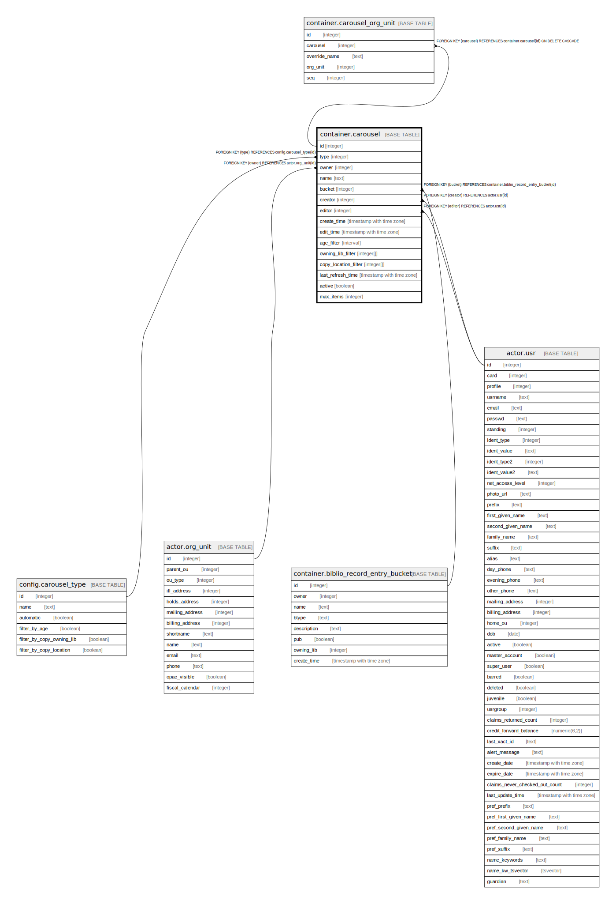

# container.carousel

## Description

## Columns

| Name | Type | Default | Nullable | Children | Parents | Comment |
| ---- | ---- | ------- | -------- | -------- | ------- | ------- |
| id | integer | nextval('container.carousel_id_seq'::regclass) | false | [container.carousel_org_unit](container.carousel_org_unit.md) |  |  |
| type | integer |  | false |  | [config.carousel_type](config.carousel_type.md) |  |
| owner | integer |  | false |  | [actor.org_unit](actor.org_unit.md) |  |
| name | text |  | false |  |  |  |
| bucket | integer |  | true |  | [container.biblio_record_entry_bucket](container.biblio_record_entry_bucket.md) |  |
| creator | integer |  | false |  | [actor.usr](actor.usr.md) |  |
| editor | integer |  | false |  | [actor.usr](actor.usr.md) |  |
| create_time | timestamp with time zone | now() | false |  |  |  |
| edit_time | timestamp with time zone | now() | false |  |  |  |
| age_filter | interval |  | true |  |  |  |
| owning_lib_filter | integer[] |  | true |  |  |  |
| copy_location_filter | integer[] |  | true |  |  |  |
| last_refresh_time | timestamp with time zone |  | true |  |  |  |
| active | boolean | true | false |  |  |  |
| max_items | integer |  | false |  |  |  |

## Constraints

| Name | Type | Definition |
| ---- | ---- | ---------- |
| carousel_owner_fkey | FOREIGN KEY | FOREIGN KEY (owner) REFERENCES actor.org_unit(id) |
| carousel_creator_fkey | FOREIGN KEY | FOREIGN KEY (creator) REFERENCES actor.usr(id) |
| carousel_editor_fkey | FOREIGN KEY | FOREIGN KEY (editor) REFERENCES actor.usr(id) |
| carousel_type_fkey | FOREIGN KEY | FOREIGN KEY (type) REFERENCES config.carousel_type(id) |
| carousel_bucket_fkey | FOREIGN KEY | FOREIGN KEY (bucket) REFERENCES container.biblio_record_entry_bucket(id) |
| carousel_pkey | PRIMARY KEY | PRIMARY KEY (id) |

## Indexes

| Name | Definition |
| ---- | ---------- |
| carousel_pkey | CREATE UNIQUE INDEX carousel_pkey ON container.carousel USING btree (id) |

## Relations

---

> Generated by [tbls](https://github.com/k1LoW/tbls)
