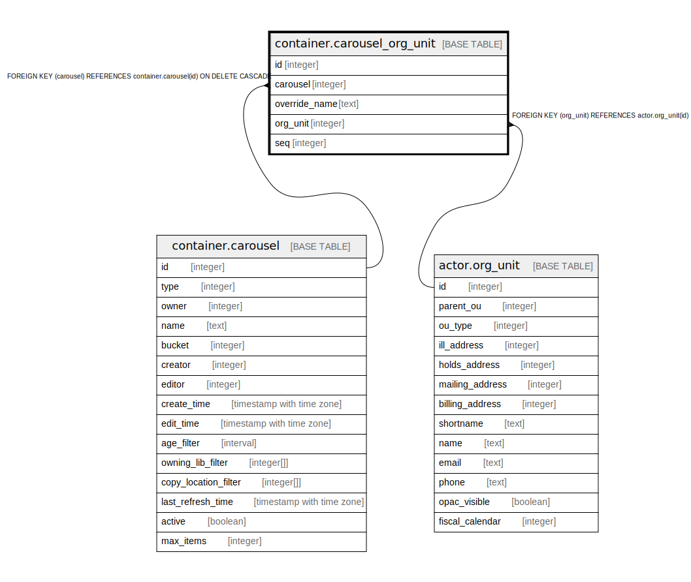

# container.carousel_org_unit

## Description

## Columns

| Name | Type | Default | Nullable | Children | Parents | Comment |
| ---- | ---- | ------- | -------- | -------- | ------- | ------- |
| id | integer | nextval('container.carousel_org_unit_id_seq'::regclass) | false |  |  |  |
| carousel | integer |  | false |  | [container.carousel](container.carousel.md) |  |
| override_name | text |  | true |  |  |  |
| org_unit | integer |  | false |  | [actor.org_unit](actor.org_unit.md) |  |
| seq | integer |  | false |  |  |  |

## Constraints

| Name | Type | Definition |
| ---- | ---- | ---------- |
| carousel_org_unit_org_unit_fkey | FOREIGN KEY | FOREIGN KEY (org_unit) REFERENCES actor.org_unit(id) |
| carousel_org_unit_pkey | PRIMARY KEY | PRIMARY KEY (id) |
| carousel_org_unit_carousel_fkey | FOREIGN KEY | FOREIGN KEY (carousel) REFERENCES container.carousel(id) ON DELETE CASCADE |

## Indexes

| Name | Definition |
| ---- | ---------- |
| carousel_org_unit_pkey | CREATE UNIQUE INDEX carousel_org_unit_pkey ON container.carousel_org_unit USING btree (id) |

## Relations

---

> Generated by [tbls](https://github.com/k1LoW/tbls)
