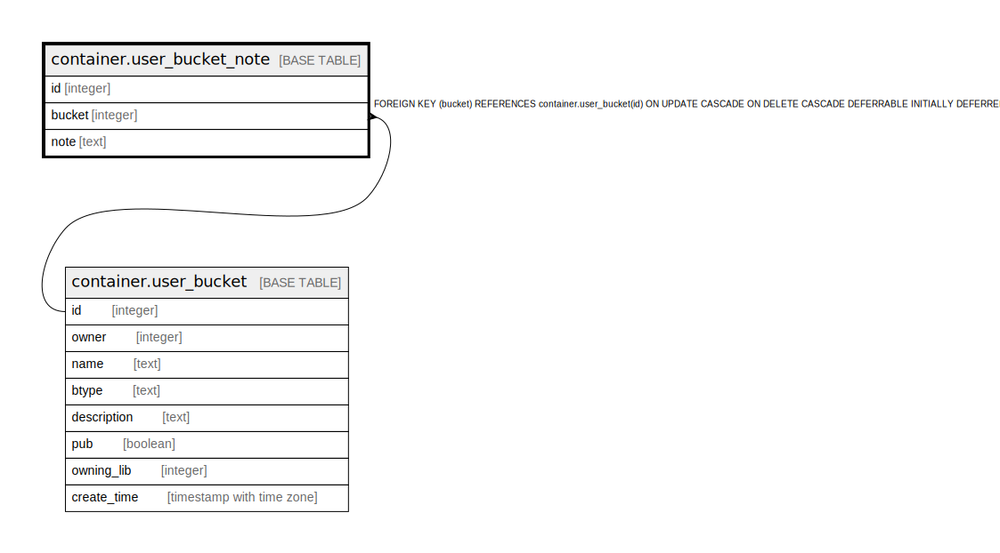

# container.user_bucket_note

## Description

## Columns

| Name | Type | Default | Nullable | Children | Parents | Comment |
| ---- | ---- | ------- | -------- | -------- | ------- | ------- |
| id | integer | nextval('container.user_bucket_note_id_seq'::regclass) | false |  |  |  |
| bucket | integer |  | false |  | [container.user_bucket](container.user_bucket.md) |  |
| note | text |  | false |  |  |  |

## Constraints

| Name | Type | Definition |
| ---- | ---- | ---------- |
| user_bucket_note_pkey | PRIMARY KEY | PRIMARY KEY (id) |
| user_bucket_note_bucket_fkey | FOREIGN KEY | FOREIGN KEY (bucket) REFERENCES container.user_bucket(id) ON UPDATE CASCADE ON DELETE CASCADE DEFERRABLE INITIALLY DEFERRED |

## Indexes

| Name | Definition |
| ---- | ---------- |
| user_bucket_note_pkey | CREATE UNIQUE INDEX user_bucket_note_pkey ON container.user_bucket_note USING btree (id) |

## Relations

---

> Generated by [tbls](https://github.com/k1LoW/tbls)
