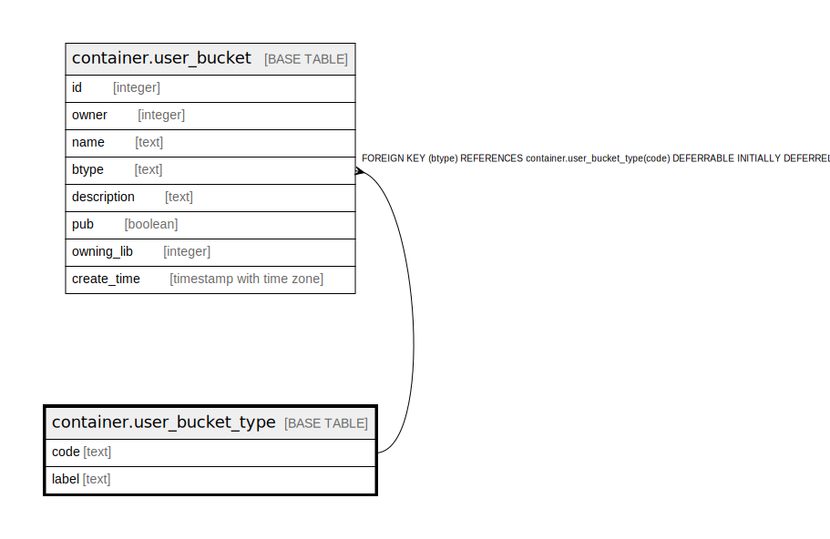

# container.user_bucket_type

## Description

## Columns

| Name | Type | Default | Nullable | Children | Parents | Comment |
| ---- | ---- | ------- | -------- | -------- | ------- | ------- |
| code | text |  | false | [container.user_bucket](container.user_bucket.md) |  |  |
| label | text |  | false |  |  |  |

## Constraints

| Name | Type | Definition |
| ---- | ---- | ---------- |
| user_bucket_type_label_key | UNIQUE | UNIQUE (label) |
| user_bucket_type_pkey | PRIMARY KEY | PRIMARY KEY (code) |

## Indexes

| Name | Definition |
| ---- | ---------- |
| user_bucket_type_label_key | CREATE UNIQUE INDEX user_bucket_type_label_key ON container.user_bucket_type USING btree (label) |
| user_bucket_type_pkey | CREATE UNIQUE INDEX user_bucket_type_pkey ON container.user_bucket_type USING btree (code) |

## Relations

---

> Generated by [tbls](https://github.com/k1LoW/tbls)
