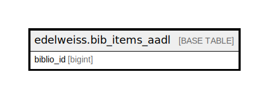

# edelweiss.bib_items_aadl

## Description

## Columns

| Name | Type | Default | Nullable | Children | Parents | Comment |
| ---- | ---- | ------- | -------- | -------- | ------- | ------- |
| biblio_id | bigint |  | true |  |  |  |

## Indexes

| Name | Definition |
| ---- | ---------- |
| edelweiss_bibitems_aadl_bibidx | CREATE INDEX edelweiss_bibitems_aadl_bibidx ON edelweiss.bib_items_aadl USING btree (biblio_id) |

## Relations

---

> Generated by [tbls](https://github.com/k1LoW/tbls)
