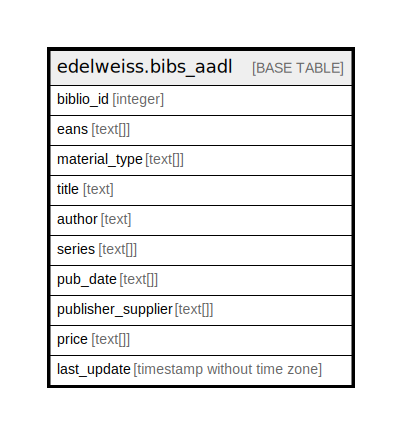

# edelweiss.bibs_aadl

## Description

## Columns

| Name | Type | Default | Nullable | Children | Parents | Comment |
| ---- | ---- | ------- | -------- | -------- | ------- | ------- |
| biblio_id | integer |  | true |  |  |  |
| eans | text[] |  | true |  |  |  |
| material_type | text[] |  | true |  |  |  |
| title | text |  | true |  |  |  |
| author | text |  | true |  |  |  |
| series | text[] |  | true |  |  |  |
| pub_date | text[] |  | true |  |  |  |
| publisher_supplier | text[] |  | true |  |  |  |
| price | text[] |  | true |  |  |  |
| last_update | timestamp without time zone |  | true |  |  |  |

## Indexes

| Name | Definition |
| ---- | ---------- |
| edelweiss_bibs_aadl_bibidx | CREATE INDEX edelweiss_bibs_aadl_bibidx ON edelweiss.bibs_aadl USING btree (biblio_id) |

## Relations

---

> Generated by [tbls](https://github.com/k1LoW/tbls)
