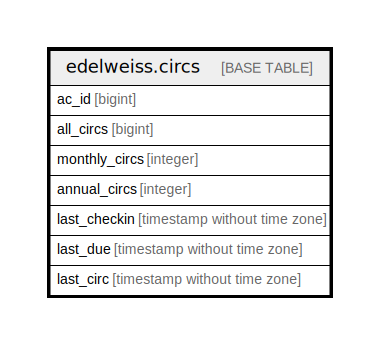

# edelweiss.circs

## Description

## Columns

| Name | Type | Default | Nullable | Children | Parents | Comment |
| ---- | ---- | ------- | -------- | -------- | ------- | ------- |
| ac_id | bigint |  | true |  |  |  |
| all_circs | bigint |  | true |  |  |  |
| monthly_circs | integer |  | true |  |  |  |
| annual_circs | integer |  | true |  |  |  |
| last_checkin | timestamp without time zone |  | true |  |  |  |
| last_due | timestamp without time zone |  | true |  |  |  |
| last_circ | timestamp without time zone |  | true |  |  |  |

## Indexes

| Name | Definition |
| ---- | ---------- |
| edelweiss_circs_acidx | CREATE INDEX edelweiss_circs_acidx ON edelweiss.circs USING btree (ac_id) |

## Relations

---

> Generated by [tbls](https://github.com/k1LoW/tbls)
