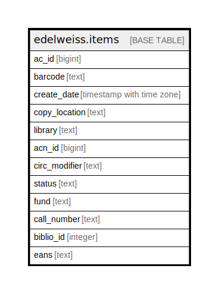

# edelweiss.items

## Description

## Columns

| Name | Type | Default | Nullable | Children | Parents | Comment |
| ---- | ---- | ------- | -------- | -------- | ------- | ------- |
| ac_id | bigint |  | true |  |  |  |
| barcode | text |  | true |  |  |  |
| create_date | timestamp with time zone |  | true |  |  |  |
| copy_location | text |  | true |  |  |  |
| library | text |  | true |  |  |  |
| acn_id | bigint |  | true |  |  |  |
| circ_modifier | text |  | true |  |  |  |
| status | text |  | true |  |  |  |
| fund | text |  | true |  |  |  |
| call_number | text |  | true |  |  |  |
| biblio_id | integer |  | true |  |  |  |
| eans | text |  | true |  |  |  |

## Indexes

| Name | Definition |
| ---- | ---------- |
| edelweiss_items_acidx | CREATE INDEX edelweiss_items_acidx ON edelweiss.items USING btree (ac_id) |
| edelweiss_items_biblioidx | CREATE INDEX edelweiss_items_biblioidx ON edelweiss.items USING btree (biblio_id) |

## Relations

---

> Generated by [tbls](https://github.com/k1LoW/tbls)
