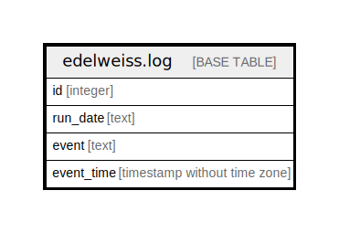

# edelweiss.log

## Description

## Columns

| Name | Type | Default | Nullable | Children | Parents | Comment |
| ---- | ---- | ------- | -------- | -------- | ------- | ------- |
| id | integer | nextval('edelweiss.log_id_seq'::regclass) | false |  |  |  |
| run_date | text |  | true |  |  |  |
| event | text |  | true |  |  |  |
| event_time | timestamp without time zone | now() | true |  |  |  |

## Relations

---

> Generated by [tbls](https://github.com/k1LoW/tbls)
