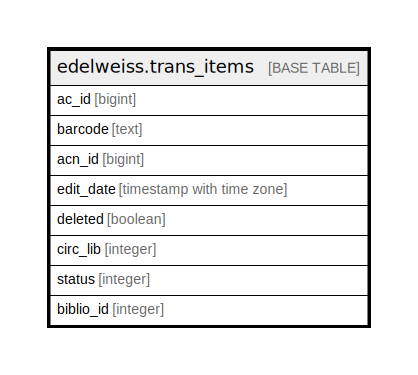

# edelweiss.trans_items

## Description

## Columns

| Name | Type | Default | Nullable | Children | Parents | Comment |
| ---- | ---- | ------- | -------- | -------- | ------- | ------- |
| ac_id | bigint |  | true |  |  |  |
| barcode | text |  | true |  |  |  |
| acn_id | bigint |  | true |  |  |  |
| edit_date | timestamp with time zone |  | true |  |  |  |
| deleted | boolean |  | true |  |  |  |
| circ_lib | integer |  | true |  |  |  |
| status | integer |  | true |  |  |  |
| biblio_id | integer |  | true |  |  |  |

## Indexes

| Name | Definition |
| ---- | ---------- |
| edelweiss_transitems_acidx | CREATE INDEX edelweiss_transitems_acidx ON edelweiss.trans_items USING btree (ac_id) |

## Relations

---

> Generated by [tbls](https://github.com/k1LoW/tbls)
