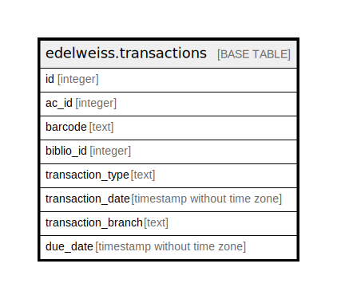

# edelweiss.transactions

## Description

## Columns

| Name | Type | Default | Nullable | Children | Parents | Comment |
| ---- | ---- | ------- | -------- | -------- | ------- | ------- |
| id | integer | nextval('edelweiss.transactions_id_seq'::regclass) | false |  |  |  |
| ac_id | integer |  | true |  |  |  |
| barcode | text |  | true |  |  |  |
| biblio_id | integer |  | true |  |  |  |
| transaction_type | text |  | true |  |  |  |
| transaction_date | timestamp without time zone |  | true |  |  |  |
| transaction_branch | text |  | true |  |  |  |
| due_date | timestamp without time zone |  | true |  |  |  |

## Relations

---

> Generated by [tbls](https://github.com/k1LoW/tbls)
