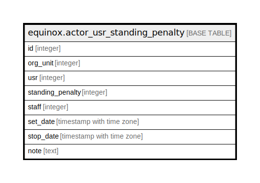

# equinox.actor_usr_standing_penalty

## Description

## Columns

| Name | Type | Default | Nullable | Children | Parents | Comment |
| ---- | ---- | ------- | -------- | -------- | ------- | ------- |
| id | integer |  | true |  |  |  |
| org_unit | integer |  | true |  |  |  |
| usr | integer |  | true |  |  |  |
| standing_penalty | integer |  | true |  |  |  |
| staff | integer |  | true |  |  |  |
| set_date | timestamp with time zone |  | true |  |  |  |
| stop_date | timestamp with time zone |  | true |  |  |  |
| note | text |  | true |  |  |  |

## Relations

---

> Generated by [tbls](https://github.com/k1LoW/tbls)
