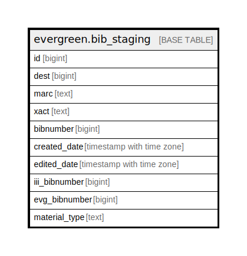

# evergreen.bib_staging

## Description

## Columns

| Name | Type | Default | Nullable | Children | Parents | Comment |
| ---- | ---- | ------- | -------- | -------- | ------- | ------- |
| id | bigint | nextval('bib_staging_id_seq'::regclass) | false |  |  |  |
| dest | bigint |  | true |  |  |  |
| marc | text |  | true |  |  |  |
| xact | text |  | true |  |  |  |
| bibnumber | bigint |  | true |  |  |  |
| created_date | timestamp with time zone |  | true |  |  |  |
| edited_date | timestamp with time zone |  | true |  |  |  |
| iii_bibnumber | bigint |  | true |  |  |  |
| evg_bibnumber | bigint |  | true |  |  |  |
| material_type | text |  | true |  |  |  |

## Indexes

| Name | Definition |
| ---- | ---------- |
| evg_bib_index | CREATE UNIQUE INDEX evg_bib_index ON evergreen.bib_staging USING btree (evg_bibnumber) |
| iii_bib_index | CREATE UNIQUE INDEX iii_bib_index ON evergreen.bib_staging USING btree (iii_bibnumber) |

## Relations

---

> Generated by [tbls](https://github.com/k1LoW/tbls)
