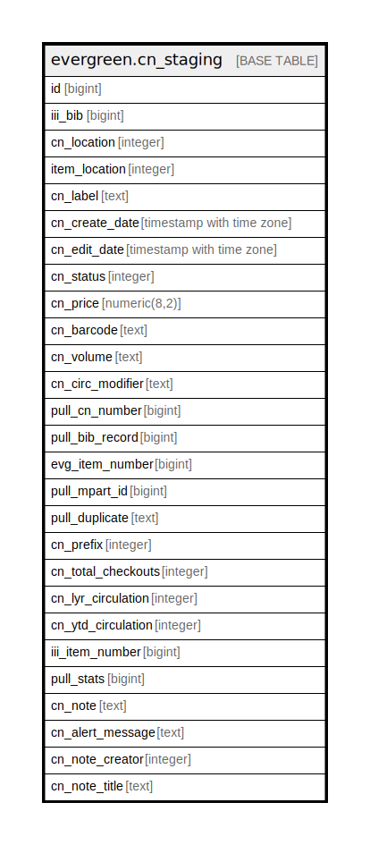

# evergreen.cn_staging

## Description

## Columns

| Name | Type | Default | Nullable | Children | Parents | Comment |
| ---- | ---- | ------- | -------- | -------- | ------- | ------- |
| id | bigint | nextval('cn_staging_id_seq'::regclass) | false |  |  |  |
| iii_bib | bigint |  | true |  |  |  |
| cn_location | integer |  | true |  |  |  |
| item_location | integer |  | true |  |  |  |
| cn_label | text |  | true |  |  |  |
| cn_create_date | timestamp with time zone |  | true |  |  |  |
| cn_edit_date | timestamp with time zone |  | true |  |  |  |
| cn_status | integer |  | true |  |  |  |
| cn_price | numeric(8,2) |  | true |  |  |  |
| cn_barcode | text |  | true |  |  |  |
| cn_volume | text |  | true |  |  |  |
| cn_circ_modifier | text |  | true |  |  |  |
| pull_cn_number | bigint |  | true |  |  |  |
| pull_bib_record | bigint |  | true |  |  |  |
| evg_item_number | bigint |  | true |  |  |  |
| pull_mpart_id | bigint |  | true |  |  |  |
| pull_duplicate | text |  | true |  |  |  |
| cn_prefix | integer |  | true |  |  |  |
| cn_total_checkouts | integer |  | true |  |  |  |
| cn_lyr_circulation | integer |  | true |  |  |  |
| cn_ytd_circulation | integer |  | true |  |  |  |
| iii_item_number | bigint |  | true |  |  |  |
| pull_stats | bigint |  | true |  |  |  |
| cn_note | text |  | true |  |  |  |
| cn_alert_message | text |  | true |  |  |  |
| cn_note_creator | integer |  | true |  |  |  |
| cn_note_title | text |  | true |  |  |  |

## Indexes

| Name | Definition |
| ---- | ---------- |
| cn_iii_bib_index | CREATE INDEX cn_iii_bib_index ON evergreen.cn_staging USING btree (iii_bib) |
| evg_item_index | CREATE UNIQUE INDEX evg_item_index ON evergreen.cn_staging USING btree (evg_item_number) |
| id_item_index | CREATE UNIQUE INDEX id_item_index ON evergreen.cn_staging USING btree (id) |
| iii_item_index | CREATE UNIQUE INDEX iii_item_index ON evergreen.cn_staging USING btree (iii_item_number) |

## Relations

---

> Generated by [tbls](https://github.com/k1LoW/tbls)
