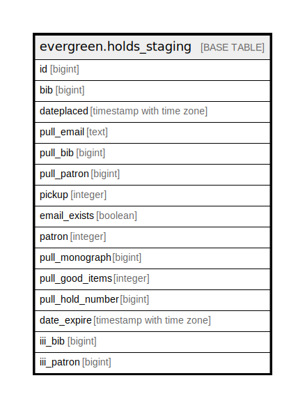

# evergreen.holds_staging

## Description

## Columns

| Name | Type | Default | Nullable | Children | Parents | Comment |
| ---- | ---- | ------- | -------- | -------- | ------- | ------- |
| id | bigint | nextval('holds_staging_id_seq'::regclass) | false |  |  |  |
| bib | bigint |  | true |  |  |  |
| dateplaced | timestamp with time zone |  | true |  |  |  |
| pull_email | text |  | true |  |  |  |
| pull_bib | bigint |  | true |  |  |  |
| pull_patron | bigint |  | true |  |  |  |
| pickup | integer |  | true |  |  |  |
| email_exists | boolean |  | true |  |  |  |
| patron | integer |  | true |  |  |  |
| pull_monograph | bigint |  | true |  |  |  |
| pull_good_items | integer |  | true |  |  |  |
| pull_hold_number | bigint |  | true |  |  |  |
| date_expire | timestamp with time zone |  | true |  |  |  |
| iii_bib | bigint |  | true |  |  |  |
| iii_patron | bigint |  | true |  |  |  |

## Indexes

| Name | Definition |
| ---- | ---------- |
| holds_id_index | CREATE UNIQUE INDEX holds_id_index ON evergreen.holds_staging USING btree (id) |
| holds_pull_bib_index | CREATE INDEX holds_pull_bib_index ON evergreen.holds_staging USING btree (pull_bib) |
| holds_pull_patron_index | CREATE INDEX holds_pull_patron_index ON evergreen.holds_staging USING btree (pull_patron) |

## Relations

---

> Generated by [tbls](https://github.com/k1LoW/tbls)
