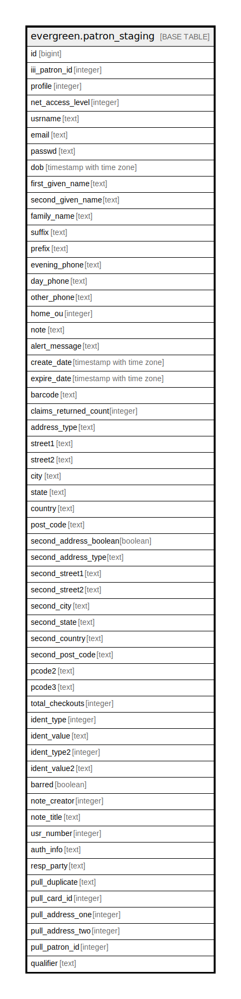

# evergreen.patron_staging

## Description

## Columns

| Name | Type | Default | Nullable | Children | Parents | Comment |
| ---- | ---- | ------- | -------- | -------- | ------- | ------- |
| id | bigint | nextval('patron_staging_id_seq'::regclass) | false |  |  |  |
| iii_patron_id | integer |  | true |  |  |  |
| profile | integer |  | true |  |  |  |
| net_access_level | integer |  | true |  |  |  |
| usrname | text |  | true |  |  |  |
| email | text |  | true |  |  |  |
| passwd | text |  | true |  |  |  |
| dob | timestamp with time zone |  | true |  |  |  |
| first_given_name | text |  | true |  |  |  |
| second_given_name | text |  | true |  |  |  |
| family_name | text |  | true |  |  |  |
| suffix | text |  | true |  |  |  |
| prefix | text |  | true |  |  |  |
| evening_phone | text |  | true |  |  |  |
| day_phone | text |  | true |  |  |  |
| other_phone | text |  | true |  |  |  |
| home_ou | integer |  | true |  |  |  |
| note | text |  | true |  |  |  |
| alert_message | text |  | true |  |  |  |
| create_date | timestamp with time zone |  | true |  |  |  |
| expire_date | timestamp with time zone |  | true |  |  |  |
| barcode | text |  | true |  |  |  |
| claims_returned_count | integer |  | true |  |  |  |
| address_type | text |  | true |  |  |  |
| street1 | text |  | true |  |  |  |
| street2 | text |  | true |  |  |  |
| city | text |  | true |  |  |  |
| state | text |  | true |  |  |  |
| country | text |  | true |  |  |  |
| post_code | text |  | true |  |  |  |
| second_address_boolean | boolean |  | true |  |  |  |
| second_address_type | text |  | true |  |  |  |
| second_street1 | text |  | true |  |  |  |
| second_street2 | text |  | true |  |  |  |
| second_city | text |  | true |  |  |  |
| second_state | text |  | true |  |  |  |
| second_country | text |  | true |  |  |  |
| second_post_code | text |  | true |  |  |  |
| pcode2 | text |  | true |  |  |  |
| pcode3 | text |  | true |  |  |  |
| total_checkouts | integer |  | true |  |  |  |
| ident_type | integer |  | true |  |  |  |
| ident_value | text |  | true |  |  |  |
| ident_type2 | integer |  | true |  |  |  |
| ident_value2 | text |  | true |  |  |  |
| barred | boolean |  | true |  |  |  |
| note_creator | integer |  | true |  |  |  |
| note_title | text |  | true |  |  |  |
| usr_number | integer |  | true |  |  |  |
| auth_info | text |  | true |  |  |  |
| resp_party | text |  | true |  |  |  |
| pull_duplicate | text |  | true |  |  |  |
| pull_card_id | integer |  | true |  |  |  |
| pull_address_one | integer |  | true |  |  |  |
| pull_address_two | integer |  | true |  |  |  |
| pull_patron_id | integer |  | true |  |  |  |
| qualifier | text |  | true |  |  |  |

## Indexes

| Name | Definition |
| ---- | ---------- |
| evg_patron_index | CREATE UNIQUE INDEX evg_patron_index ON evergreen.patron_staging USING btree (pull_patron_id) |
| iii_patron_index | CREATE UNIQUE INDEX iii_patron_index ON evergreen.patron_staging USING btree (iii_patron_id) |
| patron_staging_id_index | CREATE UNIQUE INDEX patron_staging_id_index ON evergreen.patron_staging USING btree (id) |
| patron_staging_usrname_index | CREATE UNIQUE INDEX patron_staging_usrname_index ON evergreen.patron_staging USING btree (usrname) |

## Relations

---

> Generated by [tbls](https://github.com/k1LoW/tbls)
