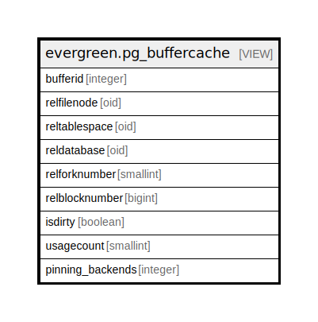

# evergreen.pg_buffercache

## Description

<details>
<summary><strong>Table Definition</strong></summary>

```sql
CREATE VIEW pg_buffercache AS (
 SELECT p.bufferid,
    p.relfilenode,
    p.reltablespace,
    p.reldatabase,
    p.relforknumber,
    p.relblocknumber,
    p.isdirty,
    p.usagecount,
    p.pinning_backends
   FROM pg_buffercache_pages() p(bufferid integer, relfilenode oid, reltablespace oid, reldatabase oid, relforknumber smallint, relblocknumber bigint, isdirty boolean, usagecount smallint, pinning_backends integer)
)
```

</details>

## Columns

| Name | Type | Default | Nullable | Children | Parents | Comment |
| ---- | ---- | ------- | -------- | -------- | ------- | ------- |
| bufferid | integer |  | true |  |  |  |
| relfilenode | oid |  | true |  |  |  |
| reltablespace | oid |  | true |  |  |  |
| reldatabase | oid |  | true |  |  |  |
| relforknumber | smallint |  | true |  |  |  |
| relblocknumber | bigint |  | true |  |  |  |
| isdirty | boolean |  | true |  |  |  |
| usagecount | smallint |  | true |  |  |  |
| pinning_backends | integer |  | true |  |  |  |

## Referenced Tables

| Name | Columns | Comment | Type |
| ---- | ------- | ------- | ---- |
| [pg_buffercache_pages](pg_buffercache_pages.md) | 0 |  |  |

## Relations



---

> Generated by [tbls](https://github.com/k1LoW/tbls)
