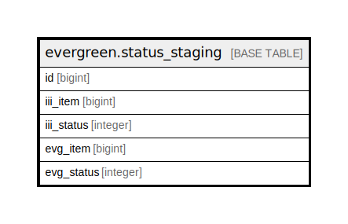

# evergreen.status_staging

## Description

## Columns

| Name | Type | Default | Nullable | Children | Parents | Comment |
| ---- | ---- | ------- | -------- | -------- | ------- | ------- |
| id | bigint | nextval('status_staging_id_seq'::regclass) | false |  |  |  |
| iii_item | bigint |  | true |  |  |  |
| iii_status | integer |  | true |  |  |  |
| evg_item | bigint |  | true |  |  |  |
| evg_status | integer |  | true |  |  |  |

## Indexes

| Name | Definition |
| ---- | ---------- |
| staging_evg_id_index | CREATE UNIQUE INDEX staging_evg_id_index ON evergreen.status_staging USING btree (evg_item) |
| staging_id_index | CREATE UNIQUE INDEX staging_id_index ON evergreen.status_staging USING btree (id) |

## Relations

---

> Generated by [tbls](https://github.com/k1LoW/tbls)
