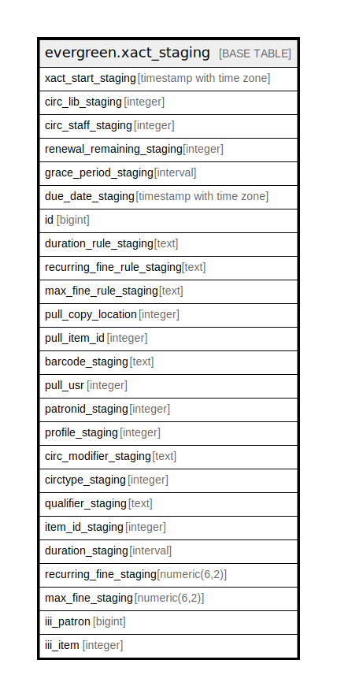

# evergreen.xact_staging

## Description

## Columns

| Name | Type | Default | Nullable | Children | Parents | Comment |
| ---- | ---- | ------- | -------- | -------- | ------- | ------- |
| xact_start_staging | timestamp with time zone |  | true |  |  |  |
| circ_lib_staging | integer |  | true |  |  |  |
| circ_staff_staging | integer |  | true |  |  |  |
| renewal_remaining_staging | integer |  | true |  |  |  |
| grace_period_staging | interval |  | true |  |  |  |
| due_date_staging | timestamp with time zone |  | true |  |  |  |
| id | bigint | nextval('xact_staging_id_seq'::regclass) | false |  |  |  |
| duration_rule_staging | text |  | true |  |  |  |
| recurring_fine_rule_staging | text |  | true |  |  |  |
| max_fine_rule_staging | text |  | true |  |  |  |
| pull_copy_location | integer |  | true |  |  |  |
| pull_item_id | integer |  | true |  |  |  |
| barcode_staging | text |  | true |  |  |  |
| pull_usr | integer |  | true |  |  |  |
| patronid_staging | integer |  | true |  |  |  |
| profile_staging | integer |  | true |  |  |  |
| circ_modifier_staging | text |  | true |  |  |  |
| circtype_staging | integer |  | true |  |  |  |
| qualifier_staging | text |  | true |  |  |  |
| item_id_staging | integer |  | true |  |  |  |
| duration_staging | interval |  | true |  |  |  |
| recurring_fine_staging | numeric(6,2) |  | true |  |  |  |
| max_fine_staging | numeric(6,2) |  | true |  |  |  |
| iii_patron | bigint |  | true |  |  |  |
| iii_item | integer |  | true |  |  |  |

## Indexes

| Name | Definition |
| ---- | ---------- |
| xact_id | CREATE UNIQUE INDEX xact_id ON evergreen.xact_staging USING btree (id) |
| xact_iii_item | CREATE INDEX xact_iii_item ON evergreen.xact_staging USING btree (iii_item) |
| xact_iii_patron | CREATE INDEX xact_iii_patron ON evergreen.xact_staging USING btree (iii_patron) |
| xact_item_id | CREATE INDEX xact_item_id ON evergreen.xact_staging USING btree (item_id_staging) |
| xact_patronid | CREATE INDEX xact_patronid ON evergreen.xact_staging USING btree (patronid_staging) |
| xact_pull_item_id | CREATE INDEX xact_pull_item_id ON evergreen.xact_staging USING btree (pull_item_id) |

## Relations

---

> Generated by [tbls](https://github.com/k1LoW/tbls)
