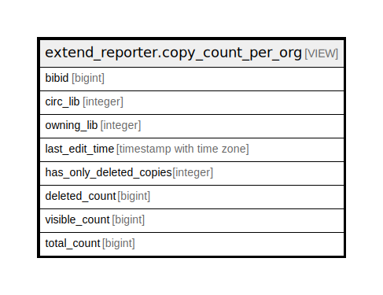

# extend_reporter.copy_count_per_org

## Description

<details>
<summary><strong>Table Definition</strong></summary>

```sql
CREATE VIEW copy_count_per_org AS (
 SELECT acn.record AS bibid,
    ac.circ_lib,
    acn.owning_lib,
    max(ac.edit_date) AS last_edit_time,
    min((ac.deleted)::integer) AS has_only_deleted_copies,
    count(
        CASE
            WHEN ac.deleted THEN ac.id
            ELSE NULL::bigint
        END) AS deleted_count,
    count(
        CASE
            WHEN (NOT ac.deleted) THEN ac.id
            ELSE NULL::bigint
        END) AS visible_count,
    count(*) AS total_count
   FROM asset.call_number acn,
    asset.copy ac
  WHERE (ac.call_number = acn.id)
  GROUP BY acn.record, acn.owning_lib, ac.circ_lib
)
```

</details>

## Columns

| Name | Type | Default | Nullable | Children | Parents | Comment |
| ---- | ---- | ------- | -------- | -------- | ------- | ------- |
| bibid | bigint |  | true |  |  |  |
| circ_lib | integer |  | true |  |  |  |
| owning_lib | integer |  | true |  |  |  |
| last_edit_time | timestamp with time zone |  | true |  |  |  |
| has_only_deleted_copies | integer |  | true |  |  |  |
| deleted_count | bigint |  | true |  |  |  |
| visible_count | bigint |  | true |  |  |  |
| total_count | bigint |  | true |  |  |  |

## Referenced Tables

| Name | Columns | Comment | Type |
| ---- | ------- | ------- | ---- |
| [asset.call_number](asset.call_number.md) | 13 |  | BASE TABLE |

## Relations



---

> Generated by [tbls](https://github.com/k1LoW/tbls)
